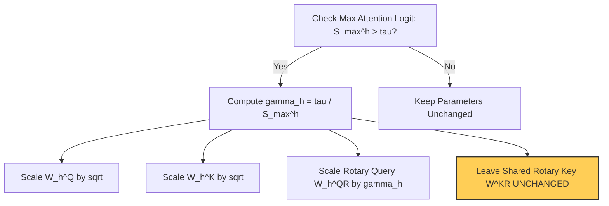

The search for good parameters is known as optimization, and the tool we use is known as an optimizer. For a long time, the Adam optimizer has been the default choice. But now there's a new, exciting challenger: the **Muon optimizer**. It is delivering impressive results on small language models and is about twice as computationally efficient as AdamW. In other words, you can train faster, use less memory, and still get great results.

### Vector-Based vs. Matrix-Based Optimization

In standard supervised learning, we use training data to compute the gradient of the loss with respect to each parameter. The gradient acts like a guide, showing which direction the parameters should move. Adam builds on this by maintaining two exponential moving averages: one for past gradients (momentum) and another for squared gradients.

> ##### WARNING
> Adam treats all parameters as a single long vector, updating each value independently without considering any internal structure. Because of this, the optimizer state takes up about twice as much memory as the model itself.
{: .block-warning }

To see the difference in overhead, we can compare their states:



**State Tracking per Parameter:**
- Current Weights ($$\theta$$)
- Momentum ($$m$$)
- Squared Gradients ($$v$$)

*Result:* Heavy memory footprint during training.


**State Tracking per Parameter:**
- Current Weights ($$\theta$$)
- Momentum ($$M$$)

*Result:* Roughly 2x more memory efficient. 



Linear layers in neural networks naturally form 2D matrices. With vector-based optimizers like Adam, the momentum matrix often becomes nearly low-rank, meaning only a small number of dominant directions truly drive the updates. Many other directions contribute very little, leading to inefficient optimization.

### The Muon Solution: Orthogonalization

The Muon optimizer tackles this issue by orthogonalizing the momentum matrix. By doing so, Muon amplifies the effect of rare directions that typically receive small or infrequent updates. Even though these directions seem minor, they are often essential for effective learning and capturing nuanced patterns in data. 

We want to find a new matrix $$O$$that is as close as possible to our momentum matrix$$M$$, but with orthogonal rows and columns ($$O^T O = I$$). 
Any linear transformation can be broken down using Singular Value Decomposition (SVD): $$M = U S V^T$$. By setting all singular values in the diagonal matrix $$S$$to one, we obtain our desired orthogonal matrix:$$O = U I V^T$$.

#### The Newton-Schultz Iteration

Performing SVD is computationally intensive and cannot be run for every update iteration. Luckily, we can use an odd polynomial matrix function, such as $$f(X) = a X + b X X^T X$$, which mathematically acts on the singular values in the same way as applying the function to each singular value individually without explicitly computing the SVD.

Consider the polynomial $$\rho(s) = 1.5s - 0.5s^3$$. Our goal is to map any input value between 0 and 1 closer to 1. By applying this function repeatedly across multiple iterations, the values rapidly converge. 

Interact with the chart below to see how applying this function iteratively pushes all singular values toward 1:

```echarts
{
  "title": { "text": "Newton-Schultz Iterations: ρ(s) = 1.5s - 0.5s³", "left": "center" },
  "tooltip": { "trigger": "axis" },
  "legend": { "data": ["Input (x)", "Iter 1", "Iter 2", "Iter 3"], "top": "10%" },
  "xAxis": { "type": "category", "data": ["0.0", "0.1", "0.2", "0.3", "0.4", "0.5", "0.6", "0.7", "0.8", "0.9", "1.0"] },
  "yAxis": { "type": "value", "max": 1.0 },
  "series": [
    { "name": "Input (x)", "type": "line", "data": [0, 0.1, 0.2, 0.3, 0.4, 0.5, 0.6, 0.7, 0.8, 0.9, 1.0], "lineStyle": {"type": "dashed", "color": "#888"} },
    { "name": "Iter 1", "type": "line", "smooth": true, "data": [0, 0.150, 0.296, 0.436, 0.568, 0.687, 0.792, 0.878, 0.944, 0.985, 1.0] },
    { "name": "Iter 2", "type": "line", "smooth": true, "data": [0, 0.222, 0.431, 0.613, 0.760, 0.868, 0.939, 0.978, 0.995, 0.999, 1.0] },
    { "name": "Iter 3", "type": "line", "smooth": true, "data": [0, 0.328, 0.606, 0.804, 0.920, 0.974, 0.994, 0.999, 1.0, 1.0, 1.0] }
  ]
}
```

By repeating this Newton-Schultz orthogonalization process five times, we obtain our matrix $$O$$ using only matrix multiplications, making it highly efficient for GPUs.

### The Muon Algorithm

Putting it all together, here is the formal update step for the Muon optimizer:

```pseudocode
\begin{algorithm}
\caption{Muon Optimizer Update}
\begin{algorithmic}
\PROCEDURE{MuonStep}{$$\theta_{t-1}, \beta, \alpha$$}
    \STATE $$G_t = \nabla L_t(\theta_{t-1})$$ 
    \STATE $$M_t = \beta M_{t-1} + G_t$$ 
    \STATE $$M'_t = \frac{M_t}{||M_t||_F}$$ 
    \STATE $$O_t = $$ \CALL{NewtonSchulz5}{$$M'_t$$} 
    \STATE $$\theta_t = \theta_{t-1} - \alpha O_t$$ 
\ENDPROCEDURE
\end{algorithmic}
\end{algorithm}
```

### Stabilizing Attention: QK-Clipping and MuonClip

When scaling up to train larger models, the performance gains over AdamW can diminish. To resolve this, researchers add weight decay and adjust the learning rate based on the 2D matrix size.

A secondary challenge is that attention logits can grow larger and larger as training continues, making the process unstable. To prevent this, we use a trick called **QK-clip**:

  * During training, monitor the maximum value of the attention logits ($$S_{max}$$).
  * If it exceeds a threshold $$\tau$$, calculate a scaling ratio $$\gamma = \tau / S_{max}$$.
  * Rescale the query ($$W^Q$$) and key ($$W^K$$) projection matrices by multiplying them by $$\sqrt{\gamma}$$.

Things become significantly trickier with Multi-Head Latent Attention (MLA), where keys and queries are compressed into a low-rank space. This compression conflicts with Rotary Position Embeddings (RoPE). Researchers utilize a decoupled RoPE technique, introducing extra multi-head queries ($$W_h^{QR}$$) but keeping a **shared** rotary key matrix ($$W^{KR}$$) across all heads.

If we applied standard per-head QK-clipping, the shared $$W^{KR}$$ matrix would be rescaled multiple times inappropriately. To handle this, the **MuonClip** technique rescales only the head-specific rotary queries by their respective $$\gamma_h$$, while leaving the shared rotary key matrix completely unchanged.





With MuonClip applied, maximum attention logits are effectively capped and stabilized, helping the optimizer maintain steady and reliable training. By moving beyond vector-based optimization and managing attention logits carefully, we achieve a highly efficient path forward for modern AI architectures.

-----

**References:**
This post was heavily inspired by the phenomenal breakdown in the video: [This Simple Optimizer Is Revolutionizing How We Train AI [Muon]](https://www.youtube.com/watch?v=bO5nvE289ec&t=1s) by Jia-Bin Huang. Check out the full video below for an exceptional visual walkthrough\!