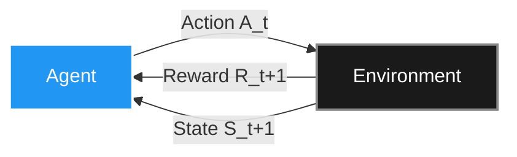

Welcome to the first post in our deep dive into Reinforcement Learning (RL)! If you’ve ever wondered how an AI learns to beat grandmasters at chess, navigate a robot dog over rough terrain, or align a Large Language Model (LLM) to chat naturally, the answer lies in RL.

At its core, RL is the science of decision-making. It’s about an agent interacting with an environment, taking actions, and receiving rewards (or penalties). The goal? Maximize the cumulative reward over time.

In this series, we will break down the mechanics of how these agents learn. Before we dive into the deep end in upcoming posts, this introductory guide will serve as our map. We will categorize the major methods, provide a high-level intuition, and look at the mathematical engines driving them.

> ##### A NOTE ON OUR SOURCES
> The foundational concepts, terminology, and classical algorithms discussed in this series are heavily grounded in the "bible" of the field: *Reinforcement Learning: An Introduction (2nd Edition)* by Richard S. Sutton and Andrew G. Barto. If you want to master the theory, that book is your starting line.
{: .block-tip }

---

### 1. The Starting Point: Multi-Armed Bandits

Before an agent can navigate a complex world, it must learn to make a single choice among multiple options. Bandit algorithms introduce the most fundamental dilemma in RL: **Exploration vs. Exploitation**. Do you exploit the choice you currently think is best, or do you explore a new choice that might be better?

**The Math (Upper Confidence Bound - UCB):** Instead of just picking the highest estimated value, UCB mathematically boosts the value of less-explored actions.

$$ A_t \doteq \underset{a}{\text{argmax}} \left[ Q_t(a) + c \sqrt{\frac{\ln t}{N_t(a)}} \right] $$

*(Where $$Q_t(a)$$ is the estimated value of action $$a$$, and the square root term is the exploration bonus based on how rarely it has been picked).*

---

### 2. Tabular Value-Based Methods (The Sutton & Barto Classics)

These methods learn the value of being in a specific state, or taking a specific action in that state. They traditionally rely on "tables" to store these values.

* **Dynamic Programming (DP):** DP assumes you have a "perfect model" of the environment (you know the exact probabilities of every outcome). It calculates values by bootstrapping—updating estimates based on the estimates of future states.

  **The Math (Bellman Optimality Equation for $$V$$):**
  $$ V_*(s) = \max_a \sum_{s', r} p(s', r | s, a) [r + \gamma V_*(s')] $$

* **Monte Carlo (MC):** MC doesn't need a model. It learns purely from experience by playing out an entire episode to the end, looking at the total return, and updating the values of the states visited.

  **The Math:**
  $$ V(S_t) \leftarrow V(S_t) + \alpha [G_t - V(S_t)] $$
  *(Where $$G_t$$ is the actual total return observed from state $$S_t$$ until the end).*

* **Temporal Difference (TD) Learning:** The best of both worlds. Like MC, it learns from raw experience without a model. Like DP, it updates its estimates step-by-step (bootstrapping) without waiting for the episode to end.

  **The Math (TD(0) update):**
  $$ V(S_t) \leftarrow V(S_t) + \alpha [R_{t+1} + \gamma V(S_{t+1}) - V(S_t)] $$

---

### 3. Model-Based RL and Planning (The Strategists)

Wait, didn't you say MC and TD don't need a model? Yes, but what if the agent learns how the world works while exploring it? Model-based methods build a simulated replica of the environment and use it to "plan" ahead (think AlphaZero playing out thousands of simulated chess moves in its head before acting).

**The Concept (Dyna Architecture):** The agent uses real experience to update its value functions *and* to learn a transition model ($$S_{t+1} \approx Model(S_t, A_t)$$). It then uses the simulated model to generate fake experiences, optimizing its policy without interacting with the real world.

---

### 4. Policy Gradient Methods (The Deep RL Era)

Tabular methods fail when the state space is too large (like the pixels on a screen or the vocabulary of an LLM). Instead of learning a table of values to figure out the best action, Policy Gradient methods parameterize the policy directly (usually with a Neural Network) and tweak the network's weights to make good actions more probable.

* **REINFORCE (Vanilla Policy Gradient):** It updates the policy weights in the direction of the gradient that maximizes expected return.

  **The Math:**
  $$ \nabla J(\theta) \propto \sum_{s} \mu(s) \sum_{a} q_\pi(s,a) \nabla \pi(a|s,\theta) $$

* **PPO (Proximal Policy Optimization):** The industry standard for training agents and early LLMs (like ChatGPT). Standard policy gradients can "fall off a cliff" if they update the weights too much at once. PPO uses a "clipping" mechanism to ensure the AI doesn't change its mind too drastically in a single step.

  **The Math (Clipped Surrogate Objective):**
  $$ L^{CLIP}(\theta) = \hat{\mathbb{E}}_t \left[ \min(r_t(\theta)\hat{A}_t, \text{clip}(r_t(\theta), 1-\epsilon, 1+\epsilon)\hat{A}_t) \right] $$

* **GRPO (Group Relative Policy Optimization):** A highly efficient variant recently popularized by models like DeepSeek. PPO requires a massive "Critic" model to compute the Advantage ($$\hat{A}_t$$). GRPO drops the Critic. Instead, it generates a group of outputs for the same prompt, scores them, and updates the policy based on their relative performance to each other.

  **The Math (Relative Advantage):** Instead of a learned baseline, the advantage is estimated via group statistics:
  $$ \hat{A}_{i} = \frac{R_i - \text{mean}(R)}{\text{std}(R)} $$

---

### 5. The Alignment Paradigm (Beyond Traditional RL)

As we moved into the era of tuning massive language models to human preferences, researchers realized that standard RL loops (train a reward model, then use PPO to optimize it) are incredibly computationally heavy and complex. This birthed a new class of offline, preference-based methods.

* **DPO (Direct Preference Optimization):** DPO mathematically proves that you don't need an explicit reward model or an RL algorithm like PPO. It reformulates the RL objective so the optimal policy can be extracted directly from a dataset of human preferences (e.g., "Answer A is better than Answer B") using standard classification techniques.

  **The Math:**
  $$ L_{DPO}(\pi_\theta; \pi_{ref}) = -\mathbb{E}_{(x, y_w, y_l)} \left[ \log \sigma \left( \beta \log \frac{\pi_\theta(y_w|x)}{\pi_{ref}(y_w|x)} - \beta \log \frac{\pi_\theta(y_l|x)}{\pi_{ref}(y_l|x)} \right) \right] $$
  *(Where the loss simply pushes the model to increase the probability of the winning response $$y_w$$ and decrease the losing response $$y_l$$, relative to a reference model).*

---

### What’s Next?

We’ve zoomed out to see the whole map—from the classic tables of [Sutton & Barto book](https://web.stanford.edu/class/psych209/Readings/SuttonBartoIPRLBook2ndEd.pdf) to the massive neural architectures aligning today's state-of-the-art AI.

In the upcoming posts, we will zoom in. We’ll code these algorithms from scratch, dissect the math line-by-line, and understand exactly how to implement them in Python.

Stay tuned for Part 2, where we will build our very first RL agent from the ground up using Multi-Armed Bandits!