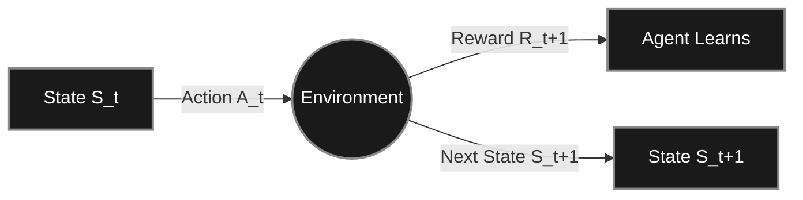

*If you missed the previous chapter, start here: [Part 2: The Multi-Armed Bandit](https://smasoudrezvani.github.io/blog/2026/Armed-Bandit/)*

Welcome back! In Part 2, we solved the casino dilemma (Multi-Armed Bandits). But bandits have a major limitation: taking an action only gives you a reward; it doesn't change the world around you.

Real life is a sequence of states. If you play a move in chess, you don't just get a score—the board changes, and your next choices are entirely different. To solve this, we step out of the casino and into **Markov Decision Processes (MDPs)**.

In an MDP, an agent looks at its current State ($$S_t$$), takes an Action ($$A_t$$), receives a Reward ($$R_{t+1}$$), and transitions to a new State ($$S_{t+1}$$).

To navigate an MDP, the agent needs to figure out the value of being in each state. Today, we look at the three foundational "Tabular" methods for doing this. They are called tabular because the state space is small enough that the agent can literally keep a lookup table in memory, with a row for every possible state.

---

## 1. Dynamic Programming (DP): The Omniscient Planner

Dynamic Programming is less about "learning" through trial and error, and more about "planning."

To use DP, the agent requires a perfect model of the environment. This means the agent has a cheat sheet containing the exact transition probabilities $$p(s', r \mid s, a)$$— it knows exactly the odds of ending up in state$$S'$$if it takes action$$A$$in state$$S$$. 

Because it knows how the world works, the agent never actually has to play the game to learn. It sweeps through its table of states, updating the value of each state based on the calculated values of all possible next states.

**The Math (Value Iteration):**
$$V(s) \leftarrow \max_a \sum_{s', r} p(s', r | s, a) [r + \gamma V(s')]$$

> ##### THE CORE CONCEPT
> This is called **bootstrapping**. The agent updates its estimate for state $$S$$ based on its existing estimates for state $$S'$$. It pulls itself up by its own bootstraps.
{: .block-tip }

**The DP Catch:** DP is mathematically perfect but practically limited. In the real world (like driving a car or playing a video game), you almost never have a perfect, probabilistic model of how the universe will react to your actions. Furthermore, if your game has millions of states, sweeping through the whole table at every step becomes computationally impossible.

---

## 2. Monte Carlo (MC): The Patient Explorer

If DP is planning, Monte Carlo is purely experiential learning. MC doesn't know the rules of the world (no model). It learns simply by playing the game, taking notes, and averaging the results.

An MC agent drops into a state, follows its policy until the very end of the episode (e.g., until it wins or loses a game), looks at the total cumulative reward ($$G_t$$), and then goes back to update the values of all the states it visited along the way.

**The Math:**
$$V(S_t) \leftarrow V(S_t) + \alpha [G_t - V(S_t)]$$
*(Where $$\alpha$$ is a learning rate, and $$G_t$$ is the actual, observed total return from state $$S_t$$ to the end).*

> ##### THE CORE CONCEPT
> This is called **sampling**. Instead of calculating all possible futures like DP, MC just experiences one actual future and learns from it. It does not bootstrap—it waits for the absolute truth ($$G_t$$) at the end of the episode before updating.
{: .block-tip }

**The MC Catch:** Because it must wait until the episode finishes to know the total return $$G_t$$, MC is useless for continuous, never-ending tasks. It also suffers from high variance: if you play a great game of chess but make one fatal blunder at the end, MC might incorrectly lower the value of all the brilliant early moves you made.

---

## 3. Temporal Difference (TD) Learning: The Best of Both Worlds

Temporal Difference (TD) is arguably the most important breakthrough in modern Reinforcement Learning. It combines the raw, model-free experiential learning of Monte Carlo with the step-by-step bootstrapping of Dynamic Programming.

Like MC, a TD agent doesn't need a model of the world; it learns from experience. But like DP, it doesn't wait until the end of the episode to learn. It updates its guess based on its very next guess. 

If a TD agent is driving to work and hits terrible traffic 10 minutes into the trip, it instantly lowers its value estimate for the route, rather than waiting until it arrives at the office to realize it's late.

**The Math (TD(0)):**
$$V(S_t) \leftarrow V(S_t) + \alpha \left[ R_{t+1} + \gamma V(S_{t+1}) - V(S_t) \right]$$

> ##### THE CORE CONCEPT
> The term in the brackets is the **TD Error**. The agent compares its old estimate $$V(S_t)$$ against its new reality: the immediate reward $$R_{t+1}$$ plus the estimated value of the state it just landed in $$\gamma V(S_{t+1})$$. It learns from its own subsequent predictions.
{: .block-tip }

### The Sutton & Barto Matrix

To truly master tabular methods, you only need to understand how these three algorithms relate to two fundamental concepts: Bootstrapping and Sampling.

| Method | Requires a Model? | Bootstraps? (Step-by-Step) | Samples? (Experience) |
| :--- | :---: | :---: | :---: |
| **Dynamic Programming (DP)** | Yes | Yes | No |
| **Monte Carlo (MC)** | No | No | Yes |
| **Temporal Difference (TD)** | No | Yes | Yes |

TD Learning forms the foundation for almost all advanced RL agents today. In fact, the two most famous tabular algorithms in the world—**Q-Learning** and **SARSA**—are both Temporal Difference methods.

---

## On-Policy vs. Off-Policy Learning

The distinction between on-policy and off-policy learning is one of the most critical dividing lines in Reinforcement Learning. It dictates whether an agent learns the value of the path it is *actually walking*, or the value of the optimal path it *dreams of walking*.

In RL, agents actually operate with two policies simultaneously:
1. **The Behavior Policy:** The rules the agent uses right now to select actions and explore the environment (usually $$\epsilon$$-greedy, meaning it sometimes takes random, suboptimal actions to discover new things).
2. **The Target Policy:** The rules the agent is trying to learn the value of.

### The Analogy
Imagine learning to ride a bike along a narrow path next to a canal.
* **An On-Policy learner** knows they occasionally wobble (exploration). They evaluate the path by assuming they will wobble, so they learn to ride safely in the middle of the path to avoid falling in the water.
* **An Off-Policy learner** evaluates the path assuming they have perfect balance. They deduce that riding on the extreme edge is the mathematically shortest route. They learn the "optimal" edge route, even though their current wobbling means they keep falling into the canal during practice.

### Where the Paths Diverge (The Math)

Both SARSA and Q-Learning are TD algorithms. They both update the current state-action value $$Q(S_t, A_t)$$ based on the immediate reward $$R_{t+1}$$ plus the discounted value of the next state. The entire difference comes down to a single term.

#### SARSA (On-Policy)
SARSA gets its name from the sequence of events it uses: State, Action, Reward, next State, next Action. It waits to see what action $$A_{t+1}$$ it *actually* decides to take based on its current $$\epsilon$$-greedy policy.

$$Q(S_t, A_t) \leftarrow Q(S_t, A_t) + \alpha \left[ R_{t+1} + \gamma \mathbf{Q(S_{t+1}, A_{t+1})} - Q(S_t, A_t) \right]$$

Because it uses the actual next action, the update is anchored to the agent's real future behavior.

#### Q-Learning (Off-Policy)
Q-Learning doesn't care what action the agent actually takes. It looks at the next state $$S_{t+1}$$ and greedily assumes it will take the absolute best possible action available.

$$Q(S_t, A_t) \leftarrow Q(S_t, A_t) + \alpha \left[ R_{t+1} + \gamma \mathbf{\max_a Q(S_{t+1}, a)} - Q(S_t, A_t) \right]$$

Notice the $$\max_a$$ operator. By taking the maximum, Q-Learning artificially severs the target update from the agent's actual exploratory behavior.

---

### The Canonical Example: Cliff Walking

Imagine a 12x4 grid where the agent must travel from the bottom-left to the bottom-right. The entire bottom edge between start and goal is a cliff. Falling off yields a massive penalty of -100. Every other step costs -1. The agent uses an $$\epsilon$$-greedy policy.

| Algorithm | What it learns | Why? |
| :--- | :--- | :--- |
| **Q-Learning** | The absolute shortest path, directly along the edge of the cliff. | The $$\max_a$$ operator assumes it will always make the perfect move next. It ignores its own random exploration mistakes. |
| **SARSA** | A longer, safer path that swings wide around the cliff. | Its update explicitly factors in the reality that it has a 10% chance of making a random move, realizing that standing next to the cliff is dangerous. |

**Which is better?**
If you want to deploy the agent with exploration turned entirely off ($$\epsilon = 0$$) after training, Q-Learning learned the mathematically superior path. If the agent must continue to explore or operate in a noisy environment where mistakes happen, SARSA's safer policy is practically superior.

---
