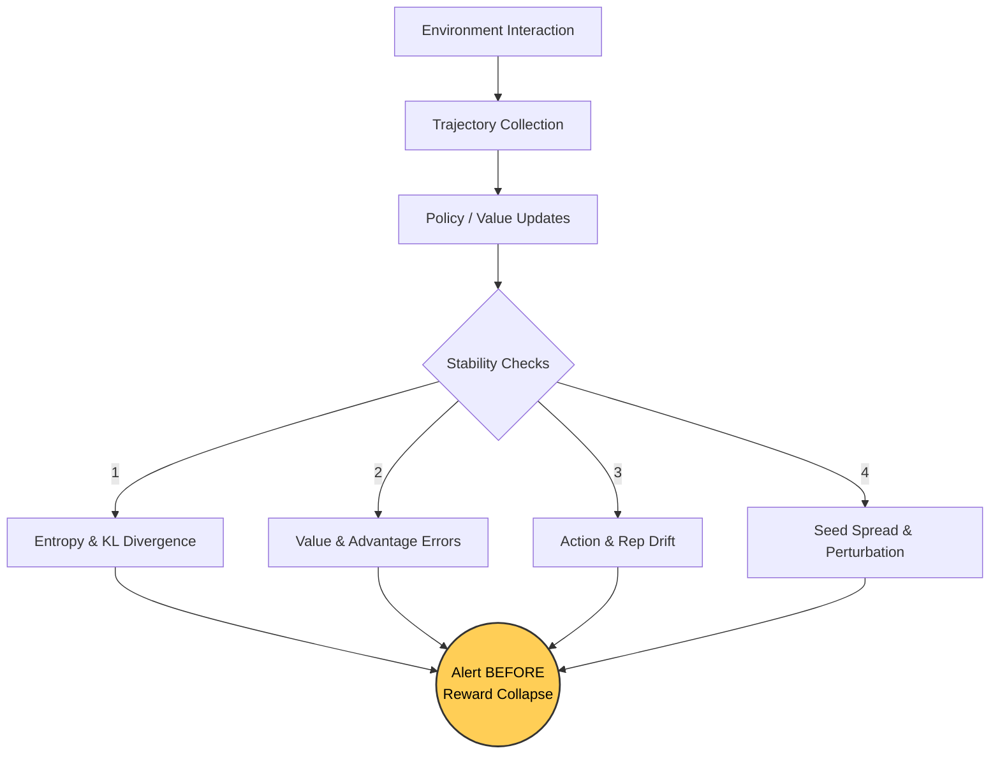

*If you missed the previous chapter on tabular methods, catch up here: [Part 3: Stepping into the World – Tabular Value-Based Methods](https://smasoudrezvani.github.io/blog/2026/Tabular-methods/)*

Reinforcement learning teams love the reward curve.

And honestly, that is part of the problem. A rising reward line looks comforting. It feels objective. It gives you something clean to screenshot and drop into a dashboard. But in real RL systems, collapse rarely arrives with a dramatic warning. More often, it sneaks in sideways. 

Exploration shrinks. Action diversity fades. Value estimates get weird. Safety margins thin out. The policy starts learning brittle shortcuts while the top-line reward still looks acceptable.

That is why strong RL engineering depends on **stability tests**, not just reward tracking. If you wait for rewards to crash, you are already late.

### Why reward alone is a lagging signal

Reward is an output metric. It tells you what happened *after* many hidden processes have already drifted. By the time reward visibly drops, the underlying training dynamics may have been degrading for thousands or millions of steps.

Think of it like a bridge. You do not wait for the bridge to fall before checking for metal fatigue. You inspect vibration, strain, and structural stress while traffic is still flowing normally. RL systems need the same mindset. A healthy training run is not just one that improves reward. It is one that remains behaviorally stable, statistically grounded, and robust under perturbation.

To visualize this "Lagging Reward Illusion," look at the chart below. Notice how policy entropy (exploration) crashes long before the reward line flattens out:

```echarts
{
  "title": { "text": "The Lagging Reward Illusion", "left": "center" },
  "tooltip": { "trigger": "axis" },
  "legend": { "data": ["Mean Reward", "Policy Entropy (Collapse)"], "bottom": 0 },
  "xAxis": { "type": "category", "name": "Training Steps", "data": ["0", "10k", "20k", "30k", "40k", "50k", "60k"] },
  "yAxis": [
    { "type": "value", "name": "Reward", "position": "left" },
    { "type": "value", "name": "Entropy", "position": "right", "inverse": false }
  ],
  "series": [
    { "name": "Mean Reward", "type": "line", "smooth": true, "data": [10, 25, 45, 60, 65, 66, 65], "lineStyle": {"width": 3, "color": "#4CAF50"} },
    { "name": "Policy Entropy (Collapse)", "yAxisIndex": 1, "type": "line", "smooth": true, "data": [5.0, 4.8, 4.2, 2.0, 0.5, 0.1, 0.05], "lineStyle": {"width": 3, "color": "#f44336", "type": "dashed"} }
  ]
}
```

### What "collapse" looks like in real RL systems

Collapse does not always mean reward goes to zero. Sometimes it looks much subtler:
* The agent repeats one action family too often.
* The value network becomes overconfident.
* Exploration decays faster than intended.
* Policy updates become too sharp and irreversible.
* Reward improves in-distribution but fails under tiny environment changes.
* Safety constraints erode while return stays flat.

Let's get concrete. Here are 10 tests to catch collapse early.

---

### 1. Policy entropy trend test
**What it checks:** This test tracks whether the policy's action distribution is narrowing too quickly. In many RL setups, especially policy-gradient methods, a steady drop in entropy is expected. But a *sudden collapse* in entropy often means the agent has become prematurely certain. That certainty may not come from genuine competence. It may come from overfitting, weak exploration pressure, or a shortcut policy that happened to work on the current trajectory mix.

**Why it matters:** A reward curve can keep rising for a while even as exploration dies. Then the environment shifts slightly, and the agent has no behavioral flexibility left. Watch the rate of entropy decay, not just the absolute value. A healthy trend looks gradual; a cliff is a warning.

### 2. Action distribution drift test
**What it checks:** This compares the policy's action frequencies across time windows. Are actions becoming sharply concentrated? Are some actions disappearing altogether? Are rare but important recovery actions vanishing?

**Why it matters:** In a robotic control task, an agent may discover that a narrow action subset gives decent average reward in the training arena. The reward holds. Everyone relaxes. Then in slightly noisier conditions, the robot loses the ability to recover because it stopped using stabilizing actions during training. That is not success; that is hidden fragility.

### 3. KL divergence spike test
**What it checks:** This measures how far the updated policy moves from the previous one. In PPO-style systems, KL is one of the clearest signals that updates are becoming unstable.

**Why it matters:** A reward increase can mask destructive update behavior for a while. If KL spikes repeatedly, the agent may be taking policy steps that are too aggressive, making learning brittle and hard to recover. Track KL over time and alert on sharp deviations, not just averages.

```python
import numpy as np

def kl_divergence(old_probs, new_probs, eps=1e-10):
    old_probs = np.clip(old_probs, eps, 1.0)
    new_probs = np.clip(new_probs, eps, 1.0)
    return np.sum(old_probs * np.log(old_probs / new_probs), axis=-1).mean()

old_policy = np.array([[0.4, 0.3, 0.3],
                       [0.5, 0.2, 0.3]])

new_policy = np.array([[0.7, 0.2, 0.1],
                       [0.8, 0.1, 0.1]])

print("Mean KL:", kl_divergence(old_policy, new_policy))
```

### 4. Value-target disagreement test
**What it checks:** This compares predicted values against realized returns or bootstrapped targets. When this gap widens persistently, your critic may be losing calibration.

**Why it matters:** You might be wondering: if the actor is still improving reward, does critic drift really matter? Yes. A miscalibrated critic quietly poisons policy improvement. It changes which actions look promising, amplifies noise, and makes the whole training loop more unstable than the reward curve suggests.

### 5. Advantage sign-flip test
**What it checks:** This tracks how often estimated advantages change sign after recomputation or across mini-batches.

**Why it matters:** If the same experience is labeled "good" in one pass and "bad" in another, your update direction is unstable. That kind of inconsistency often appears before visible performance decline, especially in noisy environments or offline RL hybrids.

### 6. Seed variance expansion test
**What it checks:** Run the same training configuration across multiple random seeds and watch the spread.

**Why it matters:** A single run can look beautiful right before the whole setup becomes unreproducible. When seed variance begins expanding, it often means the training recipe is operating near an instability boundary. One seed converges. Another oscillates. Another collapses late. That is not robustness. That is luck wearing a lab coat.

### 7. Perturbation sensitivity test
**What it checks:** Introduce tiny environment changes: observation noise, action delay, latency jitter, reward timing shifts, or minor dynamics tweaks.

**Why it matters:** A stable policy should bend a little, not shatter. If a tiny perturbation causes a big behavioral shift, the policy may be balancing on brittle correlations rather than learning durable structure. This test is powerful for agents deployed in real systems, where sensor lag or UI timing differences are normal.

### 8. Recovery trajectory test
**What it checks:** Force the agent into slightly bad or unfamiliar states and measure whether it can recover.

**Why it matters:** Many collapsing policies still perform well from ideal starting conditions. Their weakness appears only when the episode begins off-script. In production, off-script is the default. A policy that cannot recover is already half-collapsed.

### 9. Constraint violation creep test
**What it checks:** Track safety violations, invalid actions, rule breaches, or boundary-condition mistakes over time.

**Why it matters:** Some RL agents preserve reward by trading away safety margin. This is a classic pre-collapse pattern. The policy looks efficient, then gradually starts skating closer to constraint edges because those edges contain hidden reward opportunity. Reward stays high. Risk silently rises.

### 10. Representation drift test
**What it checks:** Measure how internal embeddings or latent state representations move during training. Are similar states staying clustered? Are meaningful distinctions disappearing?

**Why it matters:** When representation quality degrades, the policy may still squeeze out reward for a while using memorized shortcuts. But the foundation is weakening. Generalization gets worse. Small shifts become catastrophic.

---

### A practical monitoring flow for RL stability

Here is a clean way to structure your pipeline:



That last node matters most. The goal is not better charts. The goal is earlier intervention.

### What strong RL teams do differently

The best RL teams do not ask, *"Did reward go up?"* They ask sharper questions:
* Did exploration collapse too fast?
* Did critic calibration degrade?
* Did sensitivity to noise increase?
* Did recovery ability weaken?
* Did run-to-run variance widen?
* Did the agent become safer or just more lucky?

That shift in mindset changes everything. It turns RL monitoring from vanity analytics into real operational discipline.

> Reward tells you the story after the damage starts. Stability tests tell you when the structure begins to crack.
{: .block-warning }


```