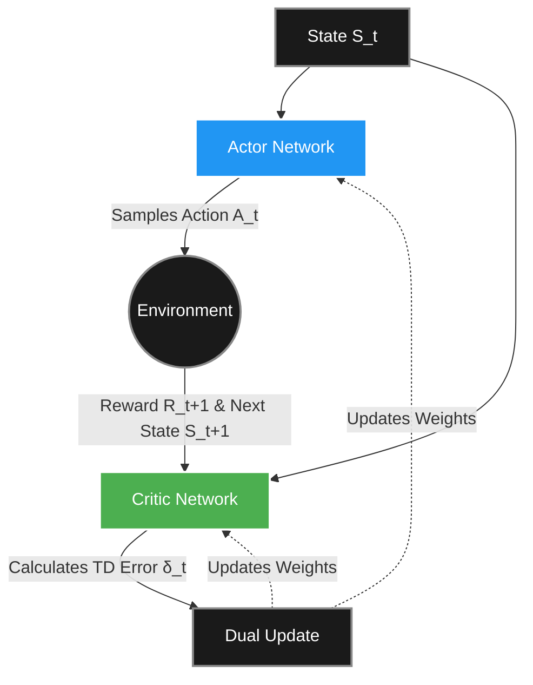

*If you missed our previous discussion on breaking the table with Neural Networks, start here: [Part 5: Breaking the Table – Function Approximation](https://smasoudrezvani.github.io/blog/2026/Function-approximation/)*

Welcome back! In Part 5, we used Neural Networks to approximate the value of states. The agent would look at its value function, figure out which action had the highest expected return, and take it.

But there is a completely different way to approach Reinforcement Learning. Instead of learning the value of an action and using that to derive a policy, what if we just learned the policy directly?

This is the domain of **Policy Gradient Methods** (covered in Chapter 13 of Sutton and Barto). Today, these methods—specifically architectures like PPO—are the primary engines behind fine-tuning massive AI systems like ChatGPT.

---

### 1. Why Abandon Value Methods?

If Q-Learning and Deep Q-Networks (DQN) are so powerful, why do we need a new approach? Value-based methods hit a wall in three specific scenarios:

* **Continuous Action Spaces:** If you are controlling a robot arm, the joint angles aren't discrete choices like "Left" or "Right." They are continuous (e.g., $$43.5^\circ$$). Finding the max action in a continuous value function requires running an expensive optimization loop at every single millisecond step.
* **Stochastic Policies:** In games like Rock-Paper-Scissors, the optimal strategy is to play randomly. A pure value-based method will always pick the single action it thinks is best, making it predictable and easy to beat.
* **Slight Changes, Massive Jumps:** In value-based methods, a tiny change to a weight in your neural network might make action A slightly better than action B, causing the policy to instantly flip 100% of its behavior to A. This makes training highly unstable.

**Policy Gradients solve this.** They output a smooth probability distribution over actions (e.g., 70% chance to go Left, 30% chance to go Right). If you tweak the network weights slightly, the probabilities just shift slightly to 71% and 29%.

---

### 2. The Math: The Policy Gradient Theorem

In this paradigm, our policy is a mathematical function (usually a neural network), denoted as $$\pi(a|s, \boldsymbol{\theta})$$, where $$\boldsymbol{\theta}$$ represents the weights of the network.

Our goal is simple: find the weights $$\boldsymbol{\theta}$$that maximize the expected total reward,$$J(\boldsymbol{\theta})$$. To do this, we use gradient ascent—we calculate the gradient (the slope) of the reward and step uphill.

The breakthrough that makes this possible is the **Policy Gradient Theorem**:

$$\nabla J(\boldsymbol{\theta}) \propto \sum_s \mu(s) \sum_a q_\pi(s,a) \nabla \pi(a|s,\boldsymbol{\theta})$$

**What this actually means in plain English:**
* $\nabla \pi(a \mid s,\boldsymbol{\theta})$: The direction we need to change the weights to make action $a$ happen more often.
* $q_\pi(s,a)$: The value (expected reward) of taking that action.

**The Result:** If an action is good (high $q$), we take a big mathematical step to make it more probable. If it's bad, we take a step to make it less probable.

> ##### THE LOG-DERIVATIVE TRICK
> In practice, algorithms like REINFORCE use a neat calculus trick to rewrite the gradient using logarithms: $$\nabla \ln \pi(A_t|S_t, \boldsymbol{\theta})$$. This converts the complex sum over all possible actions into an expectation we can actually sample from raw experience.
{: .block-tip }

---

### 3. The Actor-Critic Architecture

The purest policy gradient method (REINFORCE) suffers from terrible variance. Because it relies on Monte Carlo sampling (waiting to see the total episode reward), one lucky win can cause the network to massively boost the probability of all the terrible moves it made along the way.

To fix this, we combine Policy Gradients (the **Actor**) with our old Value-Based methods (the **Critic**).

* **The Actor:** The policy network. It decides what to do.
* **The Critic:** The value network. It watches the Actor and evaluates how good the action was compared to what was expected.

Instead of updating the Actor based on raw rewards, we update it based on the Critic's Advantage estimate: *Was this action better than average for this state?*

<style>
  .mermaid {
    display: flex;
    justify-content: center;
  }
</style>



#### The 4-Step Loop

1. **The Actor Makes a Move (State → Action)**
   The Actor network looks at the current state $$S_t$$ and outputs a probability distribution. It samples an action $$A_t$$ from this distribution and executes it in the environment.

2. **The Environment Reacts (Reward and Next State)**
   The environment transitions to the next state $$S_{t+1}$$ and hands back an immediate reward $$R_{t+1}$$.

3. **The Critic Calculates the Advantage (Computing the TD Error)**
   The Critic evaluates the move by calculating the Temporal Difference (TD) error:
   $$\delta_t = R_{t+1} + \gamma V(S_{t+1}) - V(S_t)$$
   If $$\delta_t$$ is positive, the action was better than expected (an Advantage). If negative, it was worse.

4. **The Dual Update (Adjusting the Weights)**
   * **Actor Update:** The Actor adjusts its weights to increase the probability of $$A_t$$ proportionally to the Critic's $$\delta_t$$.
   * **Critic Update:** The Critic adjusts its own weights to make its value prediction $$V(S_t)$$ closer to the newly observed reality.

Policy Gradients are beautiful because they directly optimize what we actually care about: the behavior. By pairing them with a Critic, we get the stability of value methods with the flexibility of policy learning.
```