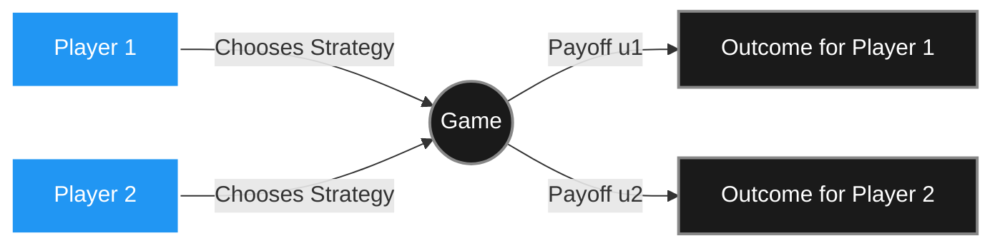

Welcome to the first post in our deep dive into Game Theory! If you've ever wondered how two competing firms decide on prices, how nations negotiate treaties, or why two rational people can end up in an outcome neither of them wanted — the answer lies in game theory.

At its core, game theory is the science of **strategic interaction**. It studies situations where the outcome for each participant depends not only on their own choices, but on the choices of everyone else. The players are assumed to be rational: they have well-defined preferences, they reason about each other, and they act to maximize their own payoffs.

In this series, we will break down the mechanics of how rational agents interact. Before we dive into the details, this introductory guide will serve as our map — covering all the major concepts, their mathematical engines, and where they connect.

> ##### A NOTE ON OUR SOURCES
> The foundational concepts, terminology, and theorems discussed in this series are drawn directly from *An Introduction to Game Theory* by Martin J. Osborne (Oxford University Press, 2003). If you want to master the theory with full mathematical rigor, that book is your starting line.
{: .block-tip }

---

### 1. The Starting Point: Normal Form Games and Nash Equilibrium

The most fundamental model in game theory is the **strategic (normal) form game**. It captures a situation where players choose their strategies simultaneously, without observing each other's choices. A game in normal form is defined by three components:

* **Players:** A finite set $$N = \{1, 2, \ldots, n\}$$.
* **Actions (Strategies):** For each player $$i$$, a set of available actions $$A_i$$.
* **Payoff Functions:** For each player $$i$$, a function $$u_i : A \rightarrow \mathbb{R}$$ that assigns a real-valued reward to every combination of actions $$a = (a_1, \ldots, a_n) \in A$$.

The central solution concept is the **Nash Equilibrium**: a strategy profile $$a^* = (a_1^*, \ldots, a_n^*)$$ where no player can improve their payoff by unilaterally deviating.

**The Math:**
$$u_i(a_i^*, a_{-i}^*) \geq u_i(a_i, a_{-i}^*) \quad \forall a_i \in A_i, \quad \forall i \in N$$

The most famous illustration is the **Prisoner's Dilemma**, where two individually rational players end up at a mutually bad outcome, because "Defect" is each player's dominant strategy regardless of what the other does.

---

### 2. Mixed Strategy Nash Equilibrium

Not all games have a pure strategy Nash Equilibrium. Consider **Matching Pennies**, where one player wins if the coins match and the other wins if they don't. Whatever pure strategy Player 1 picks, Player 2 has a profitable deviation — and vice versa. No pure strategy equilibrium exists.

The solution is to allow **mixed strategies**: probability distributions over pure actions. A mixed strategy $$\sigma_i$$ assigns a probability $$\sigma_i(a_i) \in [0,1]$$ to each action $$a_i$$, with probabilities summing to one.

**The Math (Expected Payoff):**
$$U_i(\sigma) = \sum_{a \in A} \left(\prod_{j \in N} \sigma_j(a_j)\right) u_i(a)$$

John Nash proved in 1950 that **every finite game has at least one Nash Equilibrium** — possibly in mixed strategies. This existence result is one of the most important theorems in all of mathematics.

---

### 3. Extensive Form Games: Decisions Through Time

Normal form games capture simultaneity, but many strategic situations unfold **sequentially** — one player moves, the other observes and responds. These are modeled as **extensive form games** using game trees.

A game tree has nodes (decision points), branches (available actions), and terminal nodes with payoffs. A key concept is **backward induction**: to find the optimal strategy, work backwards from the end of the game, determining what a rational player would choose at every terminal decision point.

**The Math (Backward Induction at Node $$h$$):**
$$a^*(h) = \underset{a \in A(h)}{\text{argmax}} \; V(h, a)$$

The solution concept for extensive games is **Subgame Perfect Equilibrium (SPE)**: a strategy profile that constitutes a Nash Equilibrium in every subgame. SPE eliminates non-credible threats — promises or warnings that a rational player would never actually carry out.

---

### 4. Bayesian Games: Playing with Incomplete Information

What if players don't know each other's payoffs? Perhaps you don't know whether your opponent is tough or weak in a negotiation. This is **incomplete information**, and the framework to handle it is the **Bayesian game**.

Each player has a **type** drawn from a type space $$T_i$$, distributed according to a common prior $$p(t)$$. A player knows their own type but only has probabilistic beliefs about others'.

**The Math (Bayesian Nash Equilibrium):**
$$U_i(\sigma_i^*, \sigma_{-i}^* \mid t_i) = \mathbb{E}_{t_{-i}}\left[ u_i(\sigma_i^*(t_i), \sigma_{-i}^*(t_{-i}), t) \right] \geq \mathbb{E}_{t_{-i}}\left[ u_i(a_i, \sigma_{-i}^*(t_{-i}), t) \right] \quad \forall a_i$$

A canonical example is the **first-price sealed-bid auction**: bidders don't know each other's valuations (types), yet a Bayesian Nash Equilibrium specifies a bidding strategy for every possible valuation type.

---

### 5. Bargaining Theory: Splitting the Pie

When two parties must agree on how to divide a surplus — a salary negotiation, a peace treaty, a business partnership — we enter the world of **bargaining theory**. Two main approaches exist:

* **Nash Bargaining Solution (Axiomatic):** Rather than modeling the negotiation process explicitly, Nash postulated four axioms any fair solution should satisfy (efficiency, symmetry, scale invariance, independence of irrelevant alternatives) and derived a unique solution.

  **The Math:** Maximize $$(u_1 - d_1)(u_2 - d_2)$$, where $$d = (d_1, d_2)$$ is the **disagreement point** — what each player gets if talks break down.

* **Rubinstein Alternating Offers:** A dynamic model where players alternate making offers. The unique SPE outcome is immediate agreement, with the split determined by each player's **discount factor** $$\delta_i$$ (their patience).

---

### 6. Coalitional Games: Cooperation and the Shapley Value

When players can form groups and coordinate their strategies, we enter **cooperative (coalitional) game theory**. A coalitional game is defined by a **characteristic function** $$v: 2^N \rightarrow \mathbb{R}$$, which assigns a value $$v(S)$$ to every possible coalition $$S \subseteq N$$.

The key questions are: Which coalitions will form? How should the jointly created value be distributed?

* **The Core:** The set of payoff distributions from which no coalition would want to deviate. A distribution $$x$$ is in the core if $$\sum_{i \in S} x_i \geq v(S)$$ for every coalition $$S$$.

* **The Shapley Value:** A unique, axiomatically justified payoff to each player based on their average marginal contribution across all possible orderings.

  **The Math:**
  $$\phi_i(v) = \sum_{S \subseteq N \setminus \{i\}} \frac{|S|!\,(|N| - |S| - 1)!}{|N|!} \left[ v(S \cup \{i\}) - v(S) \right]$$

---

### What's Next?

We've zoomed out to see the whole map — from the classic Prisoner's Dilemma to the elegant Shapley Value. Each of these topics has deep mathematical structure and rich real-world applications in economics, political science, evolutionary biology, and AI.

In the upcoming posts, we will zoom in on each concept. We'll dissect the math line by line, work through canonical examples, and build the intuition needed to apply these ideas.

Stay tuned for Part 2, where we will rigorously define Normal Form Games and build up to the Nash Equilibrium from first principles!
