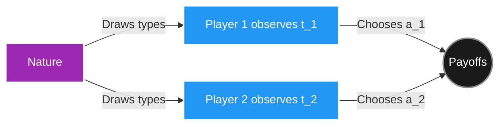

*If you missed the previous chapter, start here: [Part 4: Extensive Form Games and Backward Induction](https://smasoudrezvani.github.io/blog/2026/Extensive-Games/)*

Welcome back! In Parts 2–4, we assumed players know each other's payoffs — they understand exactly what motivates their opponents. In reality, this is rarely true. A firm doesn't know its competitor's costs. A bidder doesn't know how much a painting is worth to others. A general doesn't know the enemy's strength.

This **private information** is the defining feature of **Bayesian games**, and it leads to a fundamentally different kind of strategic reasoning.

> ##### REFERENCE NOTE
> The concepts and mathematics in this post are drawn from Chapters 9–10 of *An Introduction to Game Theory* by Martin J. Osborne (Oxford University Press, 2003).
{: .block-tip }

---

## 1. The Problem of Incomplete Information

**Incomplete information** means players do not know the payoff functions of their opponents (as opposed to **imperfect information**, which means they don't observe past moves).

The key insight, due to John Harsanyi (1967), is that incomplete information can be modeled as a game where each player has a privately known **type** that determines their payoffs. All players share a common prior belief about the distribution of types.

**Example:** In a bilateral trade, the buyer's private valuation $$v_b$$ is drawn from $$[0,1]$$. The seller's private cost $$c_s$$ is also drawn from $$[0,1]$$. Neither knows the other's number. Their types determine whether trade is mutually beneficial.

---

## 2. Formal Definition: Bayesian Game

A **Bayesian game** (or game of incomplete information) is defined by:

* A set of players $$N = \{1, \ldots, n\}$$.
* For each player $$i$$: an action set $$A_i$$, and a **type space** $$T_i$$.
* A **joint prior distribution** $$p \in \Delta(T_1 \times \cdots \times T_n)$$ over type profiles, assumed to be **common knowledge**.
* For each player $$i$$: a **payoff function** $$u_i : A \times T \rightarrow \mathbb{R}$$, which depends on all actions and all types.

The timing of a Bayesian game:
1. Nature draws a type profile $$(t_1, \ldots, t_n)$$ from $$p$$.
2. Each player $$i$$ privately observes their own type $$t_i$$ only.
3. Players simultaneously choose actions based on their types.

---

## 3. Strategies and Bayesian Nash Equilibrium

In a Bayesian game, a **strategy** for player $$i$$ is a function $$\sigma_i : T_i \rightarrow A_i$$ (or $$\Delta(A_i)$$ for mixed strategies) — a mapping from each possible type to an action.

Player $$i$$ of type $$t_i$$ evaluates strategy profile $$\sigma$$ by taking the expectation over the other players' types:

$$U_i(\sigma \mid t_i) = \mathbb{E}_{t_{-i} \mid t_i}\left[ u_i(\sigma_i(t_i), \sigma_{-i}(t_{-i}), t_i, t_{-i}) \right]$$

**Definition (Bayesian Nash Equilibrium):** A strategy profile $$\sigma^* = (\sigma_1^*, \ldots, \sigma_n^*)$$ is a **Bayesian Nash Equilibrium (BNE)** if, for every player $$i$$ and every type $$t_i \in T_i$$:

$$U_i(\sigma^* \mid t_i) \geq U_i(\sigma_i', \sigma_{-i}^* \mid t_i) \quad \forall \sigma_i'$$

> ##### THE CORE CONCEPT
> In a BNE, each player's strategy is a **best response** to the other players' strategies, **type-by-type**. A player of type $$t_i$$ acts optimally given their type, knowing the type distribution and the equilibrium strategies of others.
{: .block-tip }

---

## 4. Example: A Simple Two-Type Game

Consider a game where Player 2 can be one of two types: **Strong (S)** with probability $$p$$, or **Weak (W)** with probability $$1-p$$. Player 1 does not know the type. The payoff matrix (Player 2 is either type S or type W):

**If Player 2 is type S:**

|  | **L** | **R** |
| :--- | :---: | :---: |
| **U** | (1, 2) | (0, 0) |
| **D** | (0, 0) | (2, 1) |
{: .table .table-bordered .table-striped }

**If Player 2 is type W:**

|  | **L** | **R** |
| :--- | :---: | :---: |
| **U** | (1, 0) | (0, 1) |
| **D** | (0, 2) | (2, 0) |
{: .table .table-bordered .table-striped }

Player 2 knows their type and picks accordingly. Player 1 must pick U or D **before** knowing the type. Player 1's expected payoff of choosing U:

$$\mathbb{E}[U|U, \sigma_2] = p \cdot u_1(U, \sigma_2^S) + (1-p) \cdot u_1(U, \sigma_2^W)$$

A BNE specifies: what Player 2 does for each type *and* what Player 1 does — such that no one wants to deviate given correct beliefs.

---

## 5. Auctions: The Canonical Bayesian Game

Auctions are the richest application of Bayesian game theory. In a **first-price sealed-bid auction**:

* $$n$$ bidders each have a private **valuation** $$v_i$$ drawn independently from a common distribution $$F$$ on $$[0, \bar{v}]$$.
* Each bidder simultaneously submits a bid $$b_i$$.
* The highest bidder wins and pays their own bid. If bidder $$i$$ wins, their payoff is $$v_i - b_i$$; all others get 0.

**Strategy:** $$b_i(v_i)$$ — a mapping from valuation to bid.

**BNE Analysis (symmetric, $$n$$ bidders, uniform $$v_i \sim U[0,1]$$):**

In a symmetric BNE, all bidders use the same bidding function $$b(v)$$. Bidder $$i$$ with valuation $$v$$ solves:

$$\max_{b} \; (v - b) \cdot P(\text{win} \mid b)$$

$$P(\text{win} \mid b) = P(b_j(v_j) < b \; \forall j \neq i) = \left[F(b^{-1}(b))\right]^{n-1}$$

With $$F = U[0,1]$$, letting $$x = b^{-1}(b)$$ (the valuation that bids exactly $$b$$), $$P(\text{win}) = x^{n-1}$$. The first-order condition and boundary condition $$b(0) = 0$$ yield:

$$b^*(v) = \frac{n-1}{n} \cdot v$$

> ##### THE CORE CONCEPT
> In the symmetric BNE of a first-price auction with $$n$$ bidders, each bidder **shades their bid below their valuation** by a factor of $$\frac{n-1}{n}$$. With more competition (larger $$n$$), the shade factor approaches 1 — bids approach valuations.
{: .block-tip }

**Revenue Equivalence Theorem:** Under mild conditions (independent private values, symmetric bidders, risk neutrality), **all standard auction formats** (first-price, second-price, English, Dutch) yield the **same expected revenue** for the seller in their BNE. This is one of the most elegant and counterintuitive results in economics.

---

## 6. Second-Price Auctions and Dominant Strategies

In a **second-price (Vickrey) auction**, the highest bidder wins but pays the *second-highest* bid. Remarkably, bidding your true valuation is a **weakly dominant strategy**:

**Proof:** Fix any bids of the other players, and let $$m = \max_{j \neq i} b_j$$ be the highest competitor bid.

* **If $$b_i > v_i$$:** If $$b_i > m > v_i$$, you win but pay $$m > v_i$$ — a negative payoff. Bidding $$v_i$$ would have lost (better, as $$m > v_i$$). Overbidding can only hurt.
* **If $$b_i < v_i$$:** If $$v_i > m > b_i$$, you lose. Bidding $$v_i$$ would have won with payoff $$v_i - m > 0$$. Underbidding can only hurt.
* **Bidding $$b_i = v_i$$:** Never wins when $$v_i < m$$, wins and earns $$v_i - m > 0$$ when $$v_i > m$$.

This makes the second-price auction **strategy-proof** — a highly desirable property for mechanism design.

---

## Summary

| Concept | Key Idea |
| :--- | :--- |
| **Incomplete Information** | Players have private types unknown to others |
| **Bayesian Game** | Models incomplete info via type spaces and a common prior |
| **BNE** | Each type plays a best response given others' type-contingent strategies |
| **Bid Shading** | First-price equilibrium bids strictly below valuations |
| **Revenue Equivalence** | Standard auction formats yield equal expected revenue in BNE |
| **Second-Price Auction** | Dominant strategy to bid true valuation (strategy-proof) |
{: .table .table-bordered .table-striped }

---

## What's Next?

We've now mastered strategic interaction with private information. In Part 6, the final chapter, we turn to a different kind of game: **Cooperative Game Theory**. When players can make binding agreements, how should they split the gains? We'll derive the **Nash Bargaining Solution** and the **Shapley Value** — two of the most beautiful results in all of game theory.
