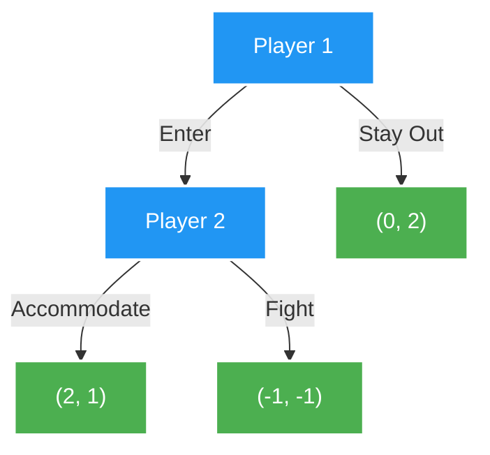
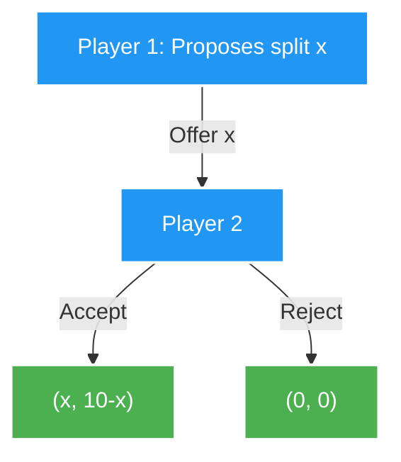

*If you missed the previous chapter, start here: [Part 3: Mixed Strategy Nash Equilibrium](https://smasoudrezvani.github.io/blog/2026/Mixed-Strategies/)*

Welcome back! So far, our players have made decisions simultaneously, in isolation. But many of the most interesting strategic situations unfold over time — one player moves, the other observes the move and responds, and so on. Today we model these **sequential interactions** using extensive form games.

> ##### REFERENCE NOTE
> The concepts and mathematics in this post are drawn from Chapters 5–6 of *An Introduction to Game Theory* by Martin J. Osborne (Oxford University Press, 2003).
{: .block-tip }

---

## 1. The Extensive Form: Describing a Game Tree

An **extensive form game** (with perfect information) is described by a game tree with the following components:

* **Nodes:** Each node represents a point where some player must make a decision.
* **Branches:** Each branch at a node represents an available action.
* **Terminal Nodes:** Leaf nodes where the game ends and payoffs are assigned.
* **Player Assignment:** Each non-terminal node is assigned to the player who moves there.
* **Payoffs:** At each terminal node, a vector $$(u_1, \ldots, u_n)$$ of payoffs for all players.

**Perfect information** means every player, when making a decision, knows the complete history of all previous moves. This is the sequential analog of seeing the full state of a chess board.

The diagram above is the **Entry Deterrence Game**: an entrant (Player 1) decides whether to Enter a market; the incumbent (Player 2) then decides whether to Fight or Accommodate. Payoffs are (Entrant, Incumbent).

---

## 2. Strategies in Extensive Games

In an extensive form game, a **strategy** for player $$i$$ is a **complete contingency plan** — it specifies an action at *every* decision node assigned to player $$i$$, even nodes that might not be reached given earlier choices.

This is subtler than it sounds. Even if Player 1's first move is "Stay Out," Player 2 must still have a strategy specifying what they would do *if* Player 1 had entered. These "off-path" plans matter for determining credibility.

**Strategy Space:** In the Entry Deterrence Game:
* Player 1's strategies: $$\{Enter, \, Stay\;Out\}$$
* Player 2's strategies: $$\{Accommodate, \, Fight\}$$ (what to do if entered)

---

## 3. Backward Induction: Reasoning Backwards

The most natural solution procedure for extensive form games with perfect information is **backward induction**: start at the terminal nodes, work backwards, and at each decision node, choose the action that maximizes the current player's payoff.

**Algorithm:**

1. Identify all decision nodes whose branches lead only to terminal nodes.
2. At each such node, assign the action with the highest payoff for the player at that node.
3. Replace the node with its resulting payoff (now it is "terminal" for the backward induction).
4. Repeat until you reach the root.

**Applying to Entry Deterrence:**

Step 1: At Player 2's node (if entered), compare Accommodate $$(2, 1)$$ vs. Fight $$(-1, -1)$$. Player 2 prefers Accommodate (payoff 1 > -1).

Step 2: Now Player 1 looks ahead: if they Enter, they get 2 (since Player 2 will Accommodate). If they Stay Out, they get 0. Player 1 prefers to Enter.

**Backward induction outcome:** (Enter, Accommodate) with payoffs (2, 1).

> ##### THE CORE CONCEPT
> The backward induction solution is unique in any **finite game of perfect information with no ties**. It captures the idea that rational players anticipate rational future behavior and plan accordingly.
{: .block-tip }

---

## 4. Nash Equilibria vs. Subgame Perfect Equilibria

Here is where things get subtle. The Entry Deterrence Game has the following Nash Equilibria:

1. **(Enter, Accommodate):** Payoffs (2, 1). Neither player wants to deviate. ✓
2. **(Stay Out, Fight):** Payoffs (0, 2). Player 1 earns 0 by staying out. But would Player 2 actually fight? Fighting gives −1 vs. Accommodating gives 1. **Player 2's threat to fight is not credible!**

Nash Equilibrium (2) survives because it is a Nash Equilibrium on paper — Player 1 stays out, so Player 2 never has to follow through on the threat. But it involves an **incredible threat**: a promise Player 2 would rationally break if actually called upon.

This is why we need a stronger solution concept.

**Definition (Subgame):** A **subgame** is any subtree of the game tree that starts at a single decision node and includes all successor nodes and their payoffs.

**Definition (Subgame Perfect Equilibrium):** A strategy profile $$\sigma^*$$ is a **Subgame Perfect Equilibrium (SPE)** if it induces a Nash Equilibrium in **every subgame** of the original game.

SPE eliminates equilibria based on non-credible threats. In Entry Deterrence, only **(Enter, Accommodate)** is an SPE — because in the subgame starting at Player 2's node, Fight is not a Nash Equilibrium action.

---

## 5. The Ultimatum Game

The Ultimatum Game beautifully illustrates the tension between theory and human behavior. Player 1 proposes a split of \$10 (e.g., "I keep $$x$$, you get $$10 - x$$"). Player 2 either Accepts or Rejects. If Player 2 Rejects, both players get \$0.

**Backward induction:** Player 2, when offered any $$x < 10$$, gets $$10 - x > 0$$ by accepting vs. 0 by rejecting. A rational Player 2 accepts any positive offer. Anticipating this, Player 1 offers the minimum possible (e.g., \$0.01) and keeps almost everything.

**The SPE prediction:** Player 1 offers essentially nothing; Player 2 accepts.

**What happens in experiments:** Real humans reject "unfair" offers (below ~30%) out of spite or a sense of fairness — a systematic deviation from the SPE prediction. This gap between theory and behavior has driven enormous research in **behavioral game theory**.

---

## 6. The Stackelberg Duopoly

In a Stackelberg market, a **Leader** (Firm 1) chooses output $$q_1$$ first, then a **Follower** (Firm 2) observes $$q_1$$ and chooses $$q_2$$. Market price is $$P = a - q_1 - q_2$$ (linear inverse demand), with zero costs.

**Step 1: Follower's best response.** Firm 2 maximizes $$\pi_2 = q_2(a - q_1 - q_2)$$:

$$\frac{\partial \pi_2}{\partial q_2} = a - q_1 - 2q_2 = 0 \implies q_2^*(q_1) = \frac{a - q_1}{2}$$

**Step 2: Leader anticipates and maximizes.** Firm 1 substitutes the follower's best response:

$$\pi_1 = q_1\left(a - q_1 - \frac{a-q_1}{2}\right) = q_1 \cdot \frac{a - q_1}{2}$$

$$\frac{d\pi_1}{dq_1} = \frac{a - 2q_1}{2} = 0 \implies q_1^* = \frac{a}{2}$$

**SPE outcome:**

$$q_1^* = \frac{a}{2}, \quad q_2^* = \frac{a}{4}, \quad P^* = \frac{a}{4}$$

> ##### THE CORE CONCEPT
> The Leader produces *twice* as much as the Follower and earns higher profits. Moving first is a **strategic advantage** — called **first-mover advantage** — because the Leader commits to a quantity that forces the Follower into a weaker position.
{: .block-tip }

---

## Summary

| Concept | Meaning |
| :--- | :--- |
| **Extensive Form Game** | Sequential game modeled as a tree |
| **Strategy** | Complete contingency plan (action at every node) |
| **Backward Induction** | Solve from terminal nodes backwards |
| **Subgame** | Subtree starting at a single decision node |
| **SPE** | NE in every subgame; eliminates non-credible threats |
| **First-Mover Advantage** | Commitment to action forces followers into weaker positions |
{: .table .table-bordered .table-striped }

---

## What's Next?

Extensive form games assume players observe all previous moves. But what if players move without observing each other's private information — their preferences, costs, or types? In Part 5, we introduce **Bayesian Games**, which handle the case of **incomplete information** and lead to the concept of Bayesian Nash Equilibrium.
