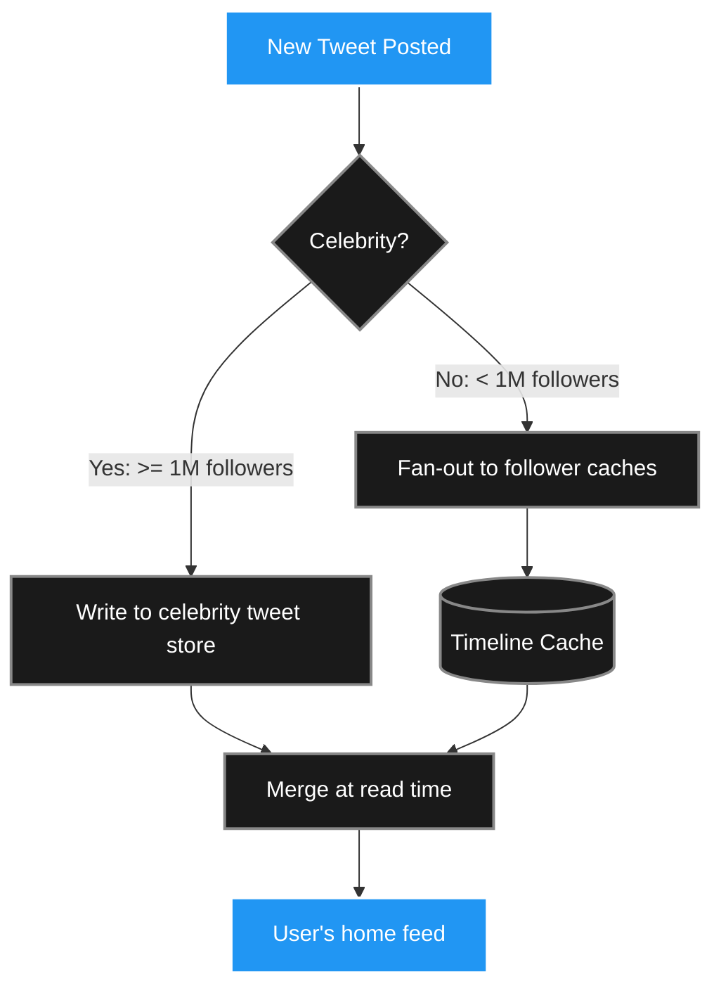

Functional requirements describe _what_ a system does. Non-functional requirements describe _how well_ it does it under real-world conditions. Chapter 2 of DDIA makes clear that this "how well" dimension is often the difference between a system that survives production and one that collapses under its own weight.

The three pillars are: **scalability**, **reliability**, and **maintainability**.

> ##### Source
>
> Notes drawn from Chapter 2 of _Designing Data-Intensive Applications_ (2nd ed.) by Martin Kleppmann & Chris Riccomini.
> {: .block-tip }

> ##### Created With
>
> These notes were structured with the help of [NotebookLM](https://notebooklm.google.com), using podcast-style audio overviews generated from the book chapters.
> {: .block-tip }

---

## 1. Scalability: Handling Growth

Scalability is not a binary property you can add after the fact. It must be designed in, and it looks different depending on which dimension is growing.

### The Twitter / X Timeline Case Study

The home timeline is a deceptively simple requirement: "show me the most recent posts from the 200 people I follow." Two strategies:

**Strategy 1 — Pull on read (normalised)**

When a user requests their timeline, execute a SQL join:

```sql
SELECT tweets.* FROM tweets
JOIN follows ON follows.followee_id = tweets.user_id
WHERE follows.follower_id = :user_id
ORDER BY tweets.created_at DESC LIMIT 20;
```

This is elegant but catastrophically slow at scale. With 10 million concurrent users refreshing every 5 seconds, you need to run this expensive multi-table join **~2 million times per second**. The database CPU pins at 100% and the system falls over.

**Strategy 2 — Fan-out on write (materialised)**

When a user posts a tweet, immediately write that tweet into a pre-computed **timeline cache** for every follower. Reading the timeline becomes a cheap, sequential key-value lookup.

**The fan-out math:**

$$\text{cache writes/sec} = \text{tweets/sec} \times \text{avg\_followers} = 5{,}800 \times 200 = 1{,}160{,}000 \text{ writes/sec}$$

That's tractable with Redis — in-memory writes are cheap.

**The celebrity problem:** If a user has 100 million followers, a single tweet triggers 100 million cache writes in seconds. The fan-out queue overflows and the system crashes.

**The hybrid solution:** Most users get fan-out on write. Celebrities are exempt — their tweets are fetched live on read and merged in memory at request time. One system uses two strategies simultaneously, choosing per-user based on follower count.



---

## 2. Performance Metrics: Why Averages Lie

### Throughput vs. Response Time

- **Throughput**: volume of work per unit time (requests/sec, MB/sec). Analogous to the diameter of a pipe.
- **Response time**: elapsed time from sending a request to receiving the full response. Includes network latency, queuing delays, and server processing.

### The Problem with Averages

Suppose 99 requests complete in 1 ms and 1 request takes 3 hours. The arithmetic mean is ~1.8 minutes — technically accurate, but it tells you nothing useful about the experience of either group.

**The fix: percentiles.**

Line up all response times from fastest to slowest:

| Percentile       | Meaning                                       |
| ---------------- | --------------------------------------------- |
| **P50** (median) | Half of requests are faster than this         |
| **P95**          | 95% of requests are faster than this          |
| **P99**          | 99% of requests are faster than this          |
| **P99.9**        | 999 out of 1000 requests are faster than this |

{: .table .table-bordered .table-striped}

Amazon optimises for P99.9 because the slowest 0.1% tend to be customers with the largest order histories — their most valuable, most frequent buyers. If you only optimise the median, you systematically penalise your best customers.

> **Rule of thumb:** Set SLOs (Service Level Objectives) in percentiles, never averages. Typical targets: P99 < 200ms, P99.9 < 1s.

### Tail Latency Amplification

In a microservices architecture, a single user-facing request fans out to dozens of backend services. The final response cannot be sent until _all_ of them reply — the slowest one dictates the overall latency.

If each of 100 backend services has a 1% chance of hitting its slow path:

$$P(\text{all fast}) = (1 - 0.01)^{100} \approx 0.366$$

So **63.4% of user requests** will be delayed by at least one slow service, even when each individual service is "slow" only 1% of the time. This is tail latency amplification.

---

## 3. Reliability

### Fault vs. Failure

- A **fault** is a localised component misbehaving (a disk dying, a node crashing).
- A **failure** is when the whole system becomes unavailable to users.

Reliable systems are engineered to tolerate faults without cascading into failures.

### Hardware Faults

- Magnetic hard drives fail at 2–5% per year. A cluster of 10,000 drives replaces one drive every single day.
- SSDs have uncorrectable bit errors.
- **Cosmic rays** — high-energy particles from stellar events — can flip a DRAM bit mid-computation (a "single-event upset"). ECC memory catches most of these.

Hardware faults are **random and independent** — they strike different machines at different times. Redundancy (RAID, dual power supplies, geographic replication) works well here.

### Software Faults Are Different

Software bugs are **correlated**: deploy the same bug to 10,000 servers and you've now deployed it 10,000 times simultaneously. A triggering condition wipes out every redundant copy at once.

Famous examples:

- **2012 leap second bug**: a Linux kernel flaw caused a large fraction of the internet to lock up the instant the extra second was added to the global clock.
- **SSD firmware bug**: drives would permanently brick themselves after exactly 32,768 hours of uptime. Data centres that bought drives in batches and powered them on together lost all their "redundant" drives in a single hour, three years later.

### Chaos Engineering

The practice of intentionally injecting faults in production — killing random servers, severing network links, corrupting data — to verify that redundancy actually works under live conditions. Netflix's Chaos Monkey is the canonical example. The only way to be confident your spares work is to prove it while the car is moving at 70 mph.

### Human Error and Blameless Culture

The majority of production incidents are ultimately caused by human operators — misconfiguration, bad deployment, accidental data deletion. The correct response is never to blame the individual. Instead, conduct **blameless postmortems** that ask: _why did the interface make this mistake easy? Why didn't the tests catch it? How do we change the system so this class of error is harder to make?_

The stakes are real. The UK Post Office Horizon scandal (1999–2019) saw hundreds of innocent branch managers prosecuted for theft and fraud because courts treated buggy accounting software as infallible truth. Software failures are not abstract — they ruin lives.

---

## 4. Scalability Strategies

### Vertical Scaling (Scale Up)

Buy a bigger machine: more CPUs, more RAM, faster disks. Simple to operate — your existing software runs unchanged. But there are hard physical limits, and a single machine is a single point of failure.

### Horizontal Scaling / Shared-Nothing Architecture (Scale Out)

Distribute load across many cheap commodity machines. No machine shares state with another; failures are isolated. If one node dies, the others continue.

The engineering complexity is substantial: data must be partitioned (sharded), consistency across nodes requires careful design, and debugging distributed systems is notoriously difficult. But horizontal scaling is the only path to true fault tolerance and theoretically unbounded capacity.

---

## 5. Maintainability

The majority of a software system's lifetime cost is not building version 1.0. It's the years of maintenance that follow: fixing bugs, adapting to new requirements, onboarding new engineers who didn't write the original code.

The key to maintainable systems is **managing complexity**:

- **Operability**: make the system easy to run, monitor, and debug. Good metrics, clear runbooks, graceful degradation.
- **Simplicity**: ruthlessly eliminate accidental complexity. Abstractions (SQL hiding B-tree internals, Kubernetes hiding VM management) let future engineers work at the right level of detail without drowning in irrelevant mechanics.
- **Evolvability**: design for change. Loose coupling, well-defined interfaces, and comprehensive tests make it possible to modify one part of the system without fear of breaking another.

---

## Key Takeaways

- Average response time is a dangerous metric that hides the worst user experiences. Track percentiles — especially P95 and P99.
- Tail latency amplification means even low per-service slow-path probabilities produce frequent slow end-to-end requests.
- Faults are inevitable; design systems to contain them rather than prevent them entirely.
- Hardware faults are random and independent; software bugs are correlated — redundancy helps with the former but not the latter.
- Horizontal scaling is the only path to true elastic capacity and fault isolation, at the cost of distributed-systems complexity.

_Next: Chapter 3 — Data Models and Query Languages._
