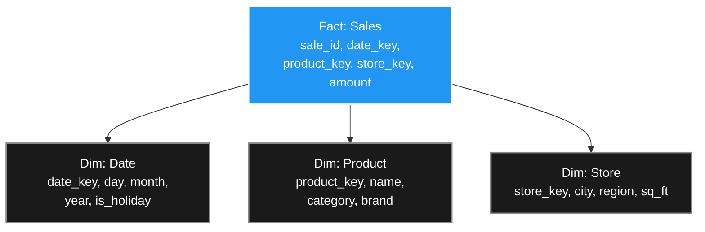

Ludwig Wittgenstein wrote: _"The limits of my language mean the limits of my world."_ In software, the data model you choose to represent your domain defines the questions you can even ask about it — and the queries you can run efficiently. Choose wrong, and performance limits become architectural limits.

Chapter 3 of DDIA surveys the major data modelling paradigms, the query languages they inspired, and the trade-offs that determine which fits your problem.

> ##### Source
>
> Notes drawn from Chapter 3 of _Designing Data-Intensive Applications_ (2nd ed.) by Martin Kleppmann & Chris Riccomini.
> {: .block-tip }

> ##### Created With
>
> These notes were structured with the help of [NotebookLM](https://notebooklm.google.com), using podcast-style audio overviews generated from the book chapters.
> {: .block-tip }

---

## 1. Layers of Abstraction

Every system stacks four abstraction layers:

1. **Application code** — real-world concepts modelled as objects, structs, and APIs.
2. **General-purpose data model** — tables, JSON documents, graph vertices. This is where the critical architectural decisions live.
3. **Storage engine** — how the data model is represented as bytes on disk.
4. **Hardware** — how bytes map to electrical signals on silicon.

The lower layers hide their complexity from the upper ones. You don't need to understand NAND flash physics to write a SQL query — but you absolutely must understand layer 2 to design a system that won't collapse at scale.

---

## 2. Declarative vs. Imperative Query Languages

### Imperative: tell the machine _how_

In an imperative approach (C, Python loops, early ORM defaults) you specify exact steps: _scan this index, iterate these rows, filter these columns_. You are micromanaging the CPU.

### Declarative: tell the machine _what_

SQL is declarative. You specify the goal — the shape of the result you want — and surrender the execution strategy to the **query optimizer**:

```sql
SELECT user_id, COUNT(*) as order_count
FROM orders
WHERE region = 'EU'
GROUP BY user_id
ORDER BY order_count DESC
LIMIT 10;
```

The optimizer decides which indexes to use, whether to do a hash join or a nested-loop join, whether to parallelize across 16 CPU cores. You get that optimization for free, and every future version of the database engine that improves the optimizer makes your query faster without any code change.

---

## 3. The Document Model

If your data forms a natural **one-to-many tree** — a user with many past jobs, a blog post with many comments, an order with many line items — the document model is a natural fit.

Instead of spreading the data across multiple joined tables, you store everything in a single self-contained JSON/BSON document. This is **data locality**: all the bytes you need live together on disk. One disk read retrieves the entire object.

```json
{
  "user_id": 42,
  "name": "Alice",
  "positions": [
    { "title": "Engineer", "company": "Acme", "years": "2019-2022" },
    { "title": "Senior Engineer", "company": "Beta Corp", "years": "2022-" }
  ],
  "education": [{ "degree": "BSc Computer Science", "school": "MIT", "year": 2019 }]
}
```

**Benefits:**

- No joins required for reading a complete entity.
- Schema flexibility — different documents can have different fields (schema-on-read).

**Limitations:**

- If you only need `current_city` from a 5 MB document, the whole 5 MB must be loaded into memory.
- Many document stores require rewriting the **entire document** on update, causing write amplification.
- Poor support for many-to-many relationships.

### The Impedance Mismatch

Object-oriented application code models data as objects; relational databases model data as flat tables. Bridging the two requires an **ORM** (Active Record, Hibernate, SQLAlchemy). ORMs are convenient for simple CRUD but hide a deadly trap.

**The N+1 query problem:** Suppose you fetch 50 students in a class, then iterate over them in Python to get each student's name. The ORM's default lazy-loading strategy executes one query to fetch the 50 IDs, then makes _50 more separate database round-trips_ — one per student. On a remote database, the network latency alone makes the page take 10 seconds to load.

The fix is **eager loading**: tell the ORM to perform a single JOIN up-front and load all data in one trip. But to do this correctly, you need to understand the SQL the ORM generates — the abstraction is leaky.

---

## 4. Normalisation vs. Denormalisation

### Why Normalise?

Storing the city name "Washington, D.C." as a foreign key integer (e.g., `region_id = 91`) instead of a raw string provides:

1. **Consistency**: all 10 million users in that city reference the same row, so there are no spelling variants ("DC", "D.C.", "Wash. D.C.").
2. **Cheap updates**: if the city is renamed, update one row; all 10 million user records reflect the change instantly.

Normalisation rule: meaningful human-readable data lives exactly once; everything else is a foreign key.

### Why Denormalise?

Joins are expensive. If millions of users request their profiles every second and each profile requires joining 5 tables, the CPU overhead becomes a bottleneck.

Denormalisation duplicates data to pre-compute joins, making reads instant at the cost of write complexity. The application code is now responsible for keeping all copies consistent.

**Twitter's hybrid strategy:** The materialised timeline cache stores only tweet IDs (the structural layout). The live like counts and profile pictures are fetched and merged in the application layer at request time. This normalises the volatile, frequently updated data while denormalising the structural outline.

---

## 5. The Star Schema and Data Warehouses

For analytical workloads (OLAP), the dominant model is the **star schema**:

- **Fact table** (centre): one row per event — a sale, a page view, a transaction. Contains foreign keys and numeric measures.
- **Dimension tables** (arms): the who, what, where, when, why — products, stores, dates, customers.



The **One Big Table (OBT)** pattern takes denormalisation to the extreme: fold all dimension data directly into the fact table during ETL. Zero joins at query time. The massive write penalty (duplication) doesn't matter in a warehouse because analytical data is largely append-only and historical — no one is updating last Tuesday's sales record.

---

## 6. Schema-on-Write vs. Schema-on-Read

|                 | Schema-on-Write (Relational)            | Schema-on-Read (Document)                           |
| --------------- | --------------------------------------- | --------------------------------------------------- |
| **Enforcement** | Database rejects non-conforming writes  | Application code interprets on read                 |
| **Migration**   | ALTER TABLE — expensive on large tables | Deploy new code; handle old/new format in app logic |
| **Best for**    | Homogeneous, well-understood data       | Heterogeneous or rapidly evolving data              |
| **Analogy**     | Static typing (compiler checks)         | Dynamic typing (runtime checks)                     |

{: .table .table-bordered .table-striped}

---

## 7. Graph Data Models

When your data has **high-density many-to-many relationships** — social networks, knowledge graphs, routing networks, fraud rings — relational tables become unwieldy. Finding "all paths of length ≤ 4 between Alice and Bob" requires a recursive SQL query of agonising complexity.

A **property graph** (used by Neo4j, Amazon Neptune) represents:

- **Vertices (nodes)**: entities (people, places, products).
- **Edges**: relationships between entities, carrying their own properties (e.g., `{since: 2019, type: "follows"}`).

The key optimisation is **index-free adjacency**: each vertex stores direct memory pointers to its neighbouring vertices. Traversing a relationship means following a pointer — O(1) — not scanning a foreign-key index.

**Cypher query** (Neo4j) — find all people who emigrated from the US to Europe:

```cypher
MATCH (person:Person)-[:BORN_IN]->(birthplace)-[:WITHIN*0..]->(us:Country {name: 'United States'}),
      (person)-[:LIVES_IN]->(location)-[:WITHIN*0..]->(eu:Continent {name: 'Europe'})
RETURN person.name
```

The `*0..` syntax traverses a **variable number of hops** — it might take 2 hops (city → country) or 4 hops (village → commune → département → country). This is natural in Cypher; the equivalent recursive SQL takes 30+ lines.

> **GraphQL ≠ graph databases**: GraphQL is an API query language for REST-like services that lets front-end clients declare the exact JSON shape they need. It has no native graph traversal semantics and does not require a graph database.

---

## 8. Event Sourcing and CQRS

Traditional databases are **state-based**: an `UPDATE` overwrites the previous value and the old state is gone forever. This makes it impossible to answer "how did we get here?" or to replay history.

**Event sourcing** flips the model: instead of storing current state, you store an immutable, append-only log of every event that ever happened.

```
Event 1: AccountCreated { user_id: 42, balance: 0 }
Event 2: Deposited { user_id: 42, amount: 100 }
Event 3: Withdrew { user_id: 42, amount: 95 }
```

The current balance ($5) is derived by replaying the log. This gives you:

- A complete audit trail.
- The ability to rebuild derived state from scratch after a bug.
- Multiple, independent **read models** computed from the same log.

**CQRS (Command Query Responsibility Segregation)** separates write path from read path:

- **Write model**: the append-only event log (Kafka, EventStoreDB).
- **Read model(s)**: materialised views derived from the log — one relational table for dashboards, one document store for customer receipts, one search index for full-text lookup — all fed by the same event stream.

**The GDPR tension**: immutable logs can't comply with the right to erasure. The solution is **crypto-shredding**: encrypt each user's personal payload with a unique key. To "delete" the user, destroy the key. The bytes remain in the log but are permanently unreadable garbage.

---

## 9. Data Frames and ML

Machine learning models are fundamentally linear algebra over matrices of numbers. A relational table with text columns ("genre: Drama", "region: EU") cannot be fed directly to a neural network.

**Data frames** (pandas, Polars, Apache Spark) are the translation layer. Common transformations:

- **One-hot encoding**: convert `genre = "Drama"` into a sparse numeric vector: `[is_drama=1, is_comedy=0, is_action=0, ...]`.
- **Normalisation**: rescale numeric columns to $$[0,1]$$ or zero-mean unit variance.
- **Pivoting/aggregation**: reduce event streams into feature vectors.

Data frames are notably **imperative** (pipeline of transformations), unlike the declarative SQL model. This is intentional: data scientists explore data incrementally, inspecting intermediate results. They need granular control over each transformation step.

---

## Key Takeaways

- The data model you choose defines not just how you store data, but which queries are natural, which are possible, and which are catastrophically expensive.
- Document models excel at self-contained hierarchies; relational models excel at many-to-many relationships; graph models excel at variable-depth traversals.
- ORMs are leaky abstractions — you must understand SQL joins to use them correctly (N+1 problem).
- Event sourcing provides a perfect audit trail and replay capability, at the cost of GDPR complexity (mitigated by crypto-shredding).
- The "schema-less" label for document databases is misleading — the schema still exists, it just lives in application code rather than the database.

_Next: Chapter 4 — Storage and Retrieval._
