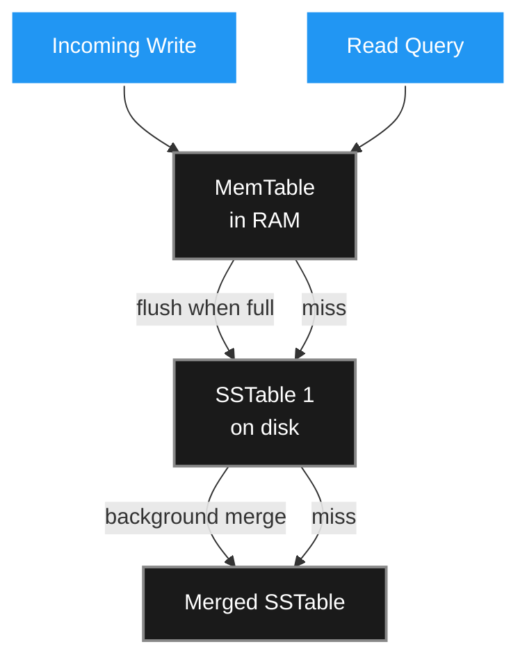

As Richard Feynman observed in a 1985 seminar: _"Computers are primarily filing systems."_ Almost every web application is, at its core, a sophisticated system for putting data into boxes and taking it out again later. Chapter 4 of DDIA pulls back the curtain on exactly how those boxes work.

You will likely never write a custom storage engine from scratch. But you absolutely need to understand them to: choose the right database for your workload, configure it correctly, and diagnose why it's running queries in 10 seconds instead of 10 milliseconds.

> ##### Source
>
> Notes drawn from Chapter 4 of _Designing Data-Intensive Applications_ (2nd ed.) by Martin Kleppmann & Chris Riccomini.
> {: .block-tip }

> ##### Created With
>
> These notes were structured with the help of [NotebookLM](https://notebooklm.google.com), using podcast-style audio overviews generated from the book chapters.
> {: .block-tip }

---

## 1. The Two-Line Database

The simplest possible key-value store is a pair of bash functions:

```bash
db_set() { echo "$1,$2" >> database; }
db_get() { grep "^$1," database | tail -n 1 | cut -d',' -f2; }
```

**`db_set`** appends a new line to a plain text file. Appending is O(1) — the fastest write operation possible. No searching, no seeking; the disk just streams data sequentially.

**`db_get`** scans the file from the end to find the most recent value. This is O(n) — as the file grows, reads slow proportionally. At a billion rows, a single lookup takes ~17 minutes. Unacceptable.

This gap between O(1) writes and O(n) reads motivates every index structure in existence.

---

## 2. Indexes: The Fundamental Trade-Off

An index is a separate data structure derived from the primary data. It acts as a signpost: "key X lives at byte offset Y." Indexes speed up reads dramatically but **slow down writes** — every write must also update every index.

This is why databases don't index every column automatically. If you index 20 columns, every insert or update touches 20 separate data structures. You must choose indexes based on the specific queries your application actually runs.

---

## 3. Hash Indexes (BitCask Model)

The simplest index is a **HashMap in RAM** mapping each key to its byte offset in the append-only log file.

```
HashMap (in RAM):
  user_42 → offset 6400
  user_89 → offset 9120
  ...
```

**Read path:** Look up the key in the HashMap (O(1)), jump directly to that byte offset on disk, read the value.

**Write path:** Append to the log, update the HashMap.

**Compaction:** Over time, the same key accumulates many historical values (old updates). A background process periodically scans the log, keeps only the most recent value per key, and writes a new compact file. The old file is deleted after the swap.

**Fatal limitation:** All keys must fit in RAM. If you have billions of unique keys, RAM runs out. And HashMaps can't answer range queries like "give me all users with IDs between 10,000 and 10,999" — keys are scattered randomly by the hash function.

---

## 4. SSTables and LSM Trees

### The Sorted String Table (SSTable)

The breakthrough idea: what if the keys in the log file were **sorted alphabetically**? We call this a Sorted String Table (SSTable).

Sorting enables a **sparse index**: instead of storing every key in RAM, you only store one key per ~4 KB block. To find `handiwork`, you look up the index, see that `handbag` starts at offset 10,000 and `handsome` starts at offset 14,000, and scan the 4 KB segment between them. The RAM footprint drops by orders of magnitude.

Sorting also makes range queries trivial: all keys between `user_10000` and `user_10999` are stored contiguously on disk. One sequential read suffices.

### The Write Problem: MemTables

You can't sort on disk efficiently — inserting in the middle of a file requires rewriting the entire right half. The solution: buffer incoming writes in a **MemTable** (a sorted in-memory data structure, typically a red-black tree or AVL tree).

1. Writes go into the MemTable (fast, in-memory sort).
2. When the MemTable reaches ~4 MB, it is flushed to disk as a new, immutable SSTable file.
3. A background process **merges** multiple SSTable files using a merge sort pass, discarding stale values and producing one clean, compact file.

This full architecture — MemTable + SSTable + background merge — is the **Log-Structured Merge Tree (LSM Tree)**, used by Cassandra, RocksDB, LevelDB, HBase, and others.



### Bloom Filters

**The missing-key problem:** If you query for a key that doesn't exist, the database must check every SSTable before giving up. This is expensive for write-heavy workloads where many keys are queried that were never written.

A **Bloom filter** is a compact bit array that answers: "was this key _definitely not_ written to this SSTable?" It never produces false negatives (if it says "not here", the key is guaranteed to be absent) but can produce false positives (it might say "maybe here" when the key isn't). A false positive just causes one unnecessary disk read — harmless. A false negative would mean silently returning "not found" for data that exists — catastrophic.

In production, Bloom filters reduce unnecessary SSTable reads by ~99%, making LSM trees viable for read-heavy workloads too.

---

## 5. B-Trees: The 50-Year Reigning Champion

While LSM trees append new files and merge them, **B-trees** update data **in place**. They are the storage engine behind PostgreSQL, MySQL (InnoDB), SQLite, and most traditional relational databases.

### Structure

The database is divided into **fixed-size pages** (typically 4 KB, matching hardware page size). Pages are organised as a balanced tree:

- **Root page**: contains references to child pages, partitioned by key range.
- **Internal pages**: further subdivide key ranges.
- **Leaf pages**: contain the actual data (or pointers to it).

Because the tree is balanced, every lookup traverses the same number of levels. For a 1 TB database, it typically takes **3–4 page reads** to find any record — remarkably fast.

### Splits and Write-Ahead Log

When a leaf page is full and a new key must be inserted, the page **splits** into two half-full pages, and the parent is updated. If the parent is also full, the split cascades upward.

Danger: if the server crashes mid-split, pages are left in an inconsistent half-written state. The fix is a **Write-Ahead Log (WAL)**: before touching any page, the database writes the intended operation to an append-only journal. On crash recovery, the database replays the WAL to finish any incomplete operations.

---

## 6. LSM Trees vs. B-Trees

### Write Amplification

A B-tree must write every change twice (WAL + page), and may trigger cascading parent updates. Changing a single byte conceptually requires writing an entire 4 KB page.

LSM trees accumulate writes in the MemTable and flush them sequentially — far lower write amplification for individual mutations.

### SSD Friendliness

SSDs erase data in large **blocks** (~512 KB) but write in small **pages** (4 KB). Random small writes (B-tree's pattern) cause the SSD's internal garbage collector to shuffle data constantly, wearing out flash cells. Sequential large writes (LSM's flush pattern) respect the hardware's natural boundaries and extend SSD lifetime significantly.

### Read Performance

B-trees: follow the tree, read 3–4 pages. Predictable, fast, optimal for point lookups.

LSM trees: check MemTable, then SSTable 1, then SSTable 2, … Bloom filters make this fast in practice, but with many SSTables, read amplification can grow. Background compaction keeps it bounded.

|                             | LSM Tree                            | B-Tree                              |
| --------------------------- | ----------------------------------- | ----------------------------------- |
| **Write throughput**        | Higher                              | Lower (write amplification)         |
| **Read throughput**         | Slightly lower                      | Higher (predictable tree walk)      |
| **SSD wear**                | Lower                               | Higher                              |
| **Worst-case read latency** | Higher (compaction I/O spikes)      | Lower (predictable)                 |
| **Use case sweet spot**     | Write-heavy (logging, IoT, metrics) | Read-heavy (OLTP, general web apps) |

---

## 7. Columnar Storage for Analytics

OLTP databases store data **row by row** — all columns of one row are stored together. This is optimal for retrieving a single record (one disk read, all columns available).

Analytical queries are the opposite: they scan millions of rows but only need 2–3 columns. Row-oriented storage wastes enormous I/O loading irrelevant columns just to throw them away.

**Column-oriented storage** stores all values of one column together:

```
price column:  [12.99, 8.50, 24.99, 3.00, ...]
product column: [69, 42, 69, 17, ...]
date column:   [2024-01-01, 2024-01-01, 2024-01-02, ...]
```

For a query like `SELECT AVG(price) FROM sales WHERE year = 2024`:

- Load only the `price` and `date` columns.
- Never touch the customer name, address, or any other column.

### Compression

Because a single column contains one data type (e.g., all integers), it compresses extremely well. The `product_id` column might have only 100 distinct values across a billion rows. **Bitmap encoding** creates one bit-array per distinct value: for product 69, the array is `0 0 0 1 0 0 1 0 ...`. **Run-length encoding** then compresses long runs of zeros: instead of storing 10,000 zeros, store the instruction "10,000 zeros". A billion-row column can compress to a few kilobytes.

Compressed column data fits in CPU cache lines, and **vectorised processing** — bitwise AND/OR operations on compressed bitmaps — lets modern CPUs evaluate `product = 69 AND region = 'EU'` across millions of records in a single instruction cycle.

### Data Cubes and Materialised Views

Some analytical queries are run so frequently that it's worth pre-computing and storing their results. A **data cube** (or materialised aggregate view) pre-computes sums and counts across common dimensions (product × date × region). Dashboard queries become instant lookups into the pre-computed grid.

Trade-off: if a user wants to filter by a dimension not included in the cube (e.g., weather), they must fall back to scanning raw data.

---

## 8. Multi-Dimensional and Vector Indexes

### R-Trees for Geospatial Queries

A standard B-tree can efficiently answer "find all users with ID between 10,000 and 10,999" (one dimension). But "find all coffee shops within 2 km with rating ≥ 4 stars" is two-dimensional — a B-tree can only use one index at a time.

**R-trees** partition the data into nested rectangular bounding boxes. To find coffee shops nearby, the database prunes entire bounding boxes that don't overlap with the search circle, then descends into overlapping boxes, simultaneously filtering on the rating dimension. Applications extend beyond geography: any multi-dimensional range query (date + temperature, user age + account balance) benefits from an R-tree.

### Vector Indexes for Semantic Search

Traditional indexes match exact values. Modern AI search requires **semantic** matching: the query "cancel my subscription" should match a document titled "How to terminate your contract" — zero shared words.

Large language models translate text into **embedding vectors** (arrays of ~1,000 floats) representing semantic meaning. Semantically similar texts map to nearby points in this high-dimensional space. The similarity metric is typically **cosine similarity** — the angle between two vectors.

Finding the nearest vectors to a query vector is the k-Nearest Neighbours problem. Exact search requires comparing the query to every stored vector (O(n)) — too slow at scale.

The **HNSW (Hierarchical Navigable Small World)** index solves this with a layered graph structure:

- Top layer: sparse graph of a few nodes with long-range connections.
- Lower layers: progressively denser graphs.
- Search: enter the top layer, greedily navigate toward the query point, then drop to the next layer for finer resolution.

Like descending from a satellite view to street view — quickly narrowing from continent to neighbourhood to building.

The result is **approximate nearest neighbour search**: not guaranteed to find the exact closest vector, but finds a very close one in O(log n) time.

---

## Key Takeaways

- Indexes always trade write performance for read performance. Choose them based on your actual query patterns.
- LSM trees (append-then-merge) excel at write-heavy workloads and are kinder to SSD hardware.
- B-trees (in-place update with WAL) remain the gold standard for read-heavy OLTP workloads.
- Columnar storage, bitmap compression, and vectorised processing enable analytical queries that would be impossibly slow in row-oriented OLTP databases.
- Vector indexes (HNSW) represent a fundamental shift: databases are moving from exact retrieval of stored facts to approximate navigation through semantic meaning.

_Next: Chapter 5 — Encoding and Evolution._
