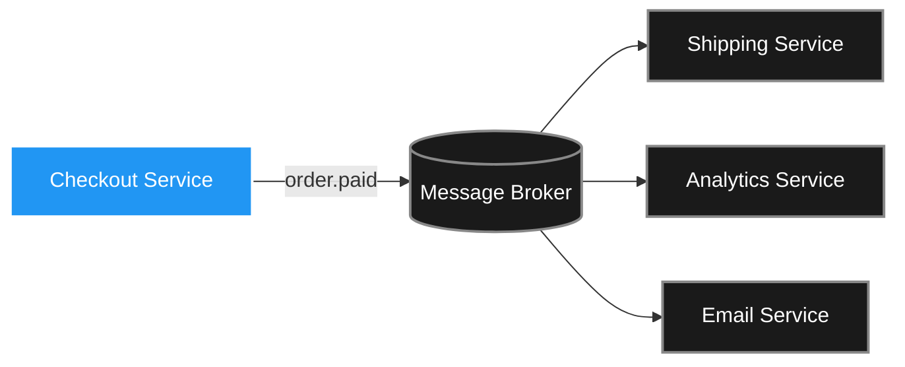

Data doesn't just sit in databases — it travels. Between services. From memory to disk. Across continents. And it must remain readable as your application evolves over months and years. Chapter 5 of DDIA covers the engineering of that travel: how to translate in-memory objects into portable bytes, how to make those bytes survive schema changes, and how to design communication patterns that are robust under distributed system realities.

> ##### Source
>
> Notes drawn from Chapter 5 of _Designing Data-Intensive Applications_ (2nd ed.) by Martin Kleppmann & Chris Riccomini.
> {: .block-tip }

> ##### Created With
>
> These notes were structured with the help of [NotebookLM](https://notebooklm.google.com), using podcast-style audio overviews generated from the book chapters.
> {: .block-tip }

---

## 1. The Rolling Upgrade Problem

You cannot upgrade a production service by shutting down all instances simultaneously. The standard technique is a **rolling upgrade**: deploy new code to a small batch of servers, verify them, then proceed to the next batch.

During this window, **old and new code run simultaneously**, both reading from and writing to the same database. This means:

- **Backward compatibility**: new code must handle data written by old code (missing fields, old formats).
- **Forward compatibility**: old code must gracefully handle data written by new code (unknown fields it has never seen).

Backward compatibility is manageable — the new code's author knows the old format. Forward compatibility is harder — old code must somehow survive encountering fields it was never compiled to understand, without crashing and without accidentally deleting them.

These two requirements shape every format and protocol decision that follows.

---

## 2. From Objects to Bytes

Application objects (hash tables, linked lists, trees) are optimised for CPU access via **memory pointers** — addresses that are local to one machine's RAM. A pointer on server A means nothing to server B.

To send data over a network or write it to disk, you must **encode** (serialise) it into a flat byte sequence that carries no machine-specific pointers. At the destination, you **decode** (deserialise) those bytes back into in-memory objects.

The key engineering question: in what format should those bytes be arranged?

---

## 3. Language-Native Formats: Never Use in Production

Every mainstream language ships a built-in serialisation library (Java Serialisation, Python `pickle`, Ruby `Marshal`). These are irresistible for beginners — one line of code and the object is on the wire.

**They are architectural traps:**

1. **Ecosystem lock-in**: Java Serialisation produces bytes only a JVM can read. When your company rewrites an analytics service in Go, the data is locked inside a Java-specific format.
2. **Remote code execution vulnerabilities**: Python's `pickle` allows the byte stream to embed instructions like "instantiate this class and call this initialiser". A malicious payload can instruct your server to open a network backdoor or delete files. Java Serialisation has been the root cause of some of the most devastating enterprise breaches in history.
3. **No schema evolution**: these formats treat forward/backward compatibility as an afterthought.

Rule: never use language-native serialisation for any data that crosses a service boundary or persists to storage.

---

## 4. Textual Formats: JSON, XML, CSV

Universal and human-readable — every language can parse them. But each carries dangerous ambiguities.

### CSV

No schema attached. Is column 3 a zip code, a phone number, or a product ID? Any comma inside a field must be escaped; escaping rules vary across parsers, causing silent corruption when moving files between systems.

### XML

Highly structured but verbose. Widely used in enterprise systems; largely replaced by JSON for APIs.

### JSON

Lightweight and ubiquitous. But:

- **No native binary support**: raw image bytes must be Base64-encoded, inflating size by ~33%.
- **No integer/float distinction**: JSON just has "number." Different runtimes interpret large numbers differently.

**The 64-bit integer trap:** JavaScript represents all numbers as 64-bit IEEE 754 doubles. The mantissa provides only 53 bits of integer precision, meaning integers larger than $$2^{53} \approx 9 \times 10^{15}$$ are silently rounded.

This is not hypothetical. When Twitter introduced Snowflake IDs (64-bit integers encoding timestamp + machine ID), browsers were silently rounding tweet IDs, making it impossible to reference or delete specific tweets. Their fix: send every ID twice in the JSON — once as a raw number (for back-end languages that handle 64-bit integers correctly) and once as a string (which JavaScript preserves exactly because it doesn't do arithmetic on strings).

### JSON Schema

The ambiguity problem can be controlled with **JSON Schema** — a declarative blueprint defining the exact types, formats, and constraints of valid JSON:

```json
{
  "type": "object",
  "properties": {
    "user_id": { "type": "integer" },
    "email": { "type": "string", "format": "email" }
  },
  "required": ["user_id", "email"],
  "additionalProperties": false
}
```

`additionalProperties: false` is a **closed content model**: any field not explicitly listed is rejected. This protects against schema drift and injection attempts.

---

## 5. Protocol Buffers: Tagged Binary Encoding

Textual formats carry every field name in every message. If you send a million user records, the string `"username"` appears a million times. Protocol Buffers (protobuf, developed at Google) eliminates this by using **integer tags** instead of string field names.

### Schema Definition

```protobuf
message User {
  string username = 1;
  int64  favorite_number = 2;
  string photo_url = 3;
}
```

### Encoding

Instead of `{"username": "Alice", "favorite_number": 42}`, the wire format is:

```
[tag=1, type=string, length=5] Alice
[tag=2, type=varint]           42
```

The strings `"username"` and `"favorite_number"` are completely absent. The decoder looks up tag 1 in its local schema file to know this means `username`. A typical protobuf message is **half the size** of the equivalent MessagePack, and a small fraction of the JSON.

### Schema Evolution Rules

The system's robustness relies on immutable tag numbers:

- **Adding a field**: assign a new, never-used tag number. Old code encountering this unknown tag knows the byte length (encoded in the wire format) and skips it safely. New code reading old data that lacks this field receives a language-default value.
- **Never change a tag number**: old data on disk and old code both rely on tag 1 meaning `username`. Reassigning it is permanently destructive.
- **Removing a field**: mark it `reserved` so no future field accidentally reuses that tag.

### Variable-Length Integers (Varints)

Standard `int64` always uses 8 bytes. Most integers in practice are small. Protobuf uses **varints** — a variable-length encoding where each byte uses 7 bits for data and 1 bit as a continuation flag:

- The number `5` encodes in **1 byte** (7 bits easily covers it; continuation bit = 0).
- The number `300` encodes in **2 bytes** (needs 9 bits; split across two bytes).
- The number `9,000,000,000,000` encodes in **7 bytes**.

For a typical user record with small IDs and short strings, this can halve the payload again compared to fixed-width encoding.

---

## 6. Apache Avro: Schema-Driven Binary Without Tags

Protobuf requires a human to manually assign integer tags to every field. For a data lake with thousands of constantly-evolving tables, this becomes an administrative nightmare. Apache Avro (created for the Hadoop ecosystem) solves this differently.

### Tag-Free Encoding

Avro's wire format contains **no field names and no tags** — just the raw values, concatenated in declaration order:

```
[varint length=5] Alice [varint] 42
```

Without a schema, this is unreadable. That's intentional.

### Schema Resolution

Avro decoding requires two schemas simultaneously:

- **Writer's schema**: the exact schema used when the data was encoded.
- **Reader's schema**: the schema the current application code expects.

The Avro library matches fields by **name** (not by tag number) and reconciles differences:

| Scenario                                         | Resolution                                                |
| ------------------------------------------------ | --------------------------------------------------------- |
| Writer has a field the reader doesn't know       | Skip the bytes for that field                             |
| Reader expects a field the writer didn't include | Use the declared default value                            |
| Writer type differs from reader type             | Apply defined type promotion rules (e.g., `int` → `long`) |

{: .table .table-bordered .table-striped}

This active translation happens without any human assigning tags. You can write a script that reads a relational database schema, generates an Avro schema dynamically, and dumps any table without manual intervention.

### Schema Delivery

The schema itself must travel alongside the data:

1. **Large files** (Hadoop, Parquet): embed the writer's schema once at the start of the file. Amortised over millions of records, the overhead is negligible.
2. **Message streams** (Kafka): use a centralised **schema registry** (Confluent Schema Registry). Each schema gets an integer version ID. Prepend that tiny integer to each message; the consumer fetches the full schema once from the registry and caches it.
3. **Network connections**: negotiate the schema during the handshake when establishing the connection, then use it for all messages on that connection.

---

## 7. REST, RPC, and the Location Transparency Fallacy

### REST

REST uses HTTP verbs (`GET`, `POST`, `PUT`, `DELETE`) against URL endpoints. Universally understood, cache-friendly, easy to inspect with curl or a browser. JSON with OpenAPI specifications is the dominant combination for external APIs.

### RPC and Its Fatal Flaw

RPC (Remote Procedure Call) tries to make a call to a remote service look identical to a local function call — "location transparency." The problem: this is a lie.

A local function call is:

- **Instantaneous** (nanoseconds)
- **Binary** — succeeds with a return value, or throws an exception

A network call is:

- **Slow** (milliseconds)
- **Has a third state** — the **timeout/void**: the request was sent, but you don't know if it arrived, succeeded, or failed

**The idempotence problem in finance:**

You call `charge_card($100)`. Timeout. Did the charge succeed? If you retry, you may double-charge the customer. If you don't retry, you may have given away goods for free. Location transparency hid the network, and now you're in an impossible state.

Modern gRPC is better — it forces you to handle deadlines and contexts — but the fundamental problem of the unreliable network cannot be abstracted away.

---

## 8. Service Discovery

In a cloud environment, the IP addresses of service instances change constantly as containers start and stop. Hard-coding an IP in a config file means your calls hit a void when that instance restarts.

**Service discovery** (Consul, ZooKeeper, Kubernetes DNS) acts as a real-time registry:

1. On startup, every service instance registers its current IP and health status.
2. Instances send heartbeats every few seconds.
3. When a client needs to call `payment-service`, it queries the registry for a healthy instance's current IP.
4. When an instance fails (heartbeat stops), it's removed from the registry within seconds.

A **service mesh** (Istio, Linkerd) extends this with a sidecar proxy alongside every service container, handling load balancing, TLS encryption, and retries transparently — the application code calls `http://payment-service` and the proxy handles everything.

---

## 9. Durable Execution

Multi-step workflows (fraud check → charge card → reserve inventory → generate shipping label) are fragile under standard RPC. If the server crashes after step 3, where do you restart? Retrying from the beginning may double-charge the customer; giving up leaves the order incomplete.

**Durable execution** frameworks (Temporal, Restate) solve this with a **persistent event log**. Every time a workflow step completes, its result is written to a durable journal. On crash recovery, the workflow replays its code against the journal:

1. "Run fraud check" → journal says "already done: approved" → inject the result, skip the network call.
2. "Charge card" → journal says "already done: txn-id 8823" → inject the result.
3. "Generate shipping label" → not in journal → actually execute.

The workflow resumes exactly where it crashed, without repeating any successful work.

**Critical constraint**: workflow code must be **deterministic** — identical inputs produce identical outputs every run. Calls to `random.random()`, `datetime.now()`, or `uuid4()` will produce different values during replay, corrupting the journal match. Use the framework's provided deterministic equivalents.

---

## 10. Event-Driven Architecture

Instead of synchronous RPC chains, **message brokers** (Kafka, RabbitMQ, AWS SQS) decouple services via asynchronous events:



The checkout service fires an `order.paid` event and moves on. It doesn't know or care which downstream services are listening. If the shipping service goes down for three hours, events pile up safely in the broker's durable queue. When it recovers, it drains the backlog without missing a single order.

The broker acts as a **shock absorber** that prevents cascading failures. It also simplifies service discovery — producers only need the broker's address, not the address of every consumer.

---

## Key Takeaways

- Rolling upgrades require both backward compatibility (new code reads old data) and forward compatibility (old code handles new fields without deleting them).
- Language-native serialisation is a security and portability trap. Never use it across service boundaries.
- JSON's number ambiguity (especially the 64-bit integer problem) can cause silent data corruption. Track this at service boundaries.
- Protocol Buffers use immutable integer tags to achieve compact binary encoding with clean schema evolution.
- Avro uses active schema resolution (writer schema + reader schema) to support fully dynamic schemas — ideal for database dumps and large-scale data pipelines.
- RPC's "location transparency" is a dangerous fiction. Network calls have a third state (timeout) that local calls don't. Design explicitly for it.
- Event-driven architectures with durable message brokers provide fault isolation that synchronous RPC chains cannot.

_"Data outlives code."_ The serialisation format you choose today may be read by systems and engineers who don't yet exist. Design for the future reader.
