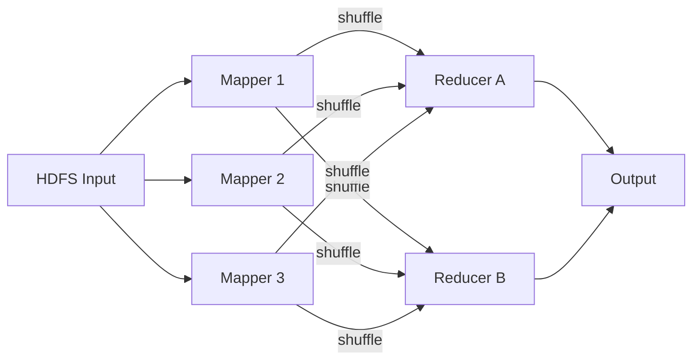
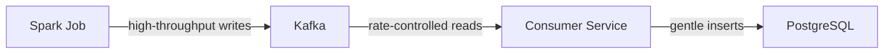

A junior engineer's beautifully optimized script finishes crunching 10 million recommendations and writes them straight to the live production database — 10 million inserts per second. Two seconds later, the pager goes off. They've launched a self-inflicted distributed denial-of-service attack on their own company. Chapter 11 of DDIA is about why that happens, and how the tech giants process petabytes without destroying their systems.

> ##### Source
>
> Notes drawn from Chapter 11 of _Designing Data-Intensive Applications_ (2nd ed.) by Martin Kleppmann & Chris Riccomini.
> {: .block-tip }

> ##### Created With
>
> These notes were structured with the help of [NotebookLM](https://notebooklm.google.com), using podcast-style audio overviews generated from the book chapters.
> {: .block-tip }

---

## 1. Online vs. Batch Processing

Most early software is **OLTP (Online Transaction Processing)**: a user clicks a button, a request hits a server, a database updates, a response comes back. The metric is **response time** — measured in milliseconds, with user abandonment beginning around 2–3 seconds.

Batch processing flips every one of those priorities:

| Property         | Online (OLTP)                   | Batch                          |
| ---------------- | ------------------------------- | ------------------------------ |
| Trigger          | User request                    | Scheduled job                  |
| Metric           | Latency                         | Throughput                     |
| Input data       | Mutable (UPDATE in place)       | Immutable (read-only)          |
| Output           | Overwrites live state           | New derived output             |
| Failure recovery | Stressful (corrupted live data) | Trivial (delete output, rerun) |

The last row is crucial. Because batch jobs read input and write output to a _different location_, the input is always intact. A bug that corrupts yesterday's recommendations is fixed by patching the code and re-running — not by writing emergency recovery scripts against a live database. This **human fault tolerance** lowers the cost of experimentation dramatically.

---

## 2. The Unix Philosophy: Small Tools and Pipes

To understand how petabyte-scale batch processing works, start with a single laptop in the 1970s. Unix showed that complex data pipelines emerge from chaining simple, single-purpose tools:

```bash
cat access.log \
  | awk '{print $7}' \
  | sort \
  | uniq -c \
  | sort -rn \
  | head -5
```

This finds the 5 most popular URLs in an nginx access log. Each tool does exactly one thing:

- `awk` extracts the URL column — filters noise
- `sort` groups identical URLs into adjacent lines
- `uniq -c` counts runs of identical adjacent lines — O(1) memory
- `sort -rn` orders by count descending
- `head -5` truncates to the answer

The **pipe** is the architectural innovation: standard output of one program flows directly to standard input of the next. Data streams through without any program needing to see the whole dataset at once.

### Why Not a Python Hash Table?

A Python script can do the same thing — instantiate a dictionary, read line by line, increment counts. For a few million rows, it's perfectly valid. For hundreds of millions, it hits a hard physical wall: **RAM exhaustion**. As the hash table grows beyond available memory, the OS begins swapping pages to disk. Because a hash table requires random access, the CPU ends up thrashing — spending 99% of its time moving data in and out of swap, effectively freezing the machine.

Unix's `sort` command avoids this with **external merge sort**.

---

## 3. Sorting Beyond Memory: Merge Sort on Disk

External merge sort respects the physics of storage hardware:

1. Read a chunk of data that fits comfortably in RAM
2. Sort it in memory
3. Write the sorted chunk sequentially to disk
4. Repeat until all chunks are written
5. Merge the sorted chunks using a streaming k-way merge

The key insight: **sequential I/O is orders of magnitude faster than random I/O**. A spinning disk must physically seek the read head to each new location. Sequential reads pay the seek penalty once, then stream data at 150 MB/s+. Random reads pay it millions of times. Merge sort is designed in deep sympathy with hardware physics — it almost never seeks randomly.

This lets a laptop with 8 GB of RAM sort a terabyte dataset. The constraint shifts from RAM size to disk size.

---

## 4. Distributed Storage: HDFS and Object Stores

When the dataset exceeds a single disk, you need distributed storage.

### HDFS: Shared-Nothing Commodity Storage

The Hadoop Distributed File System (HDFS) splits files into large blocks (default 128 MB) and distributes them across hundreds of commodity servers. A central **NameNode** maintains a metadata ledger in RAM mapping every block to its server locations.

Why 128 MB blocks? Math. If you stored a 1 PB dataset in 4 KB blocks (like a local filesystem), you'd generate 250 billion blocks. At 150 bytes of metadata each, the NameNode would need 37 TB of RAM just for the index. At 128 MB blocks, 1 PB generates only ~8 million blocks — about 1.2 GB of metadata. Block size is a deliberate trade-off to protect the centralized index from memory exhaustion.

HDFS replicates every block three times across different racks. If a hard drive fails, the NameNode detects the missing replica from heartbeat timeouts and spawns a background copy job to restore redundancy on a healthy node. Hardware failure becomes a routine operational event.

### Object Stores: Infinite Flat Key-Value

S3, GCS, and Azure Blob Storage take a different approach: there are no directories. The file path `year=2026/month=06/data.parquet` is just a string key. The "folders" in the S3 UI are a fiction — a prefix search on the flat keyspace.

The trade-off: metadata operations (renaming a "folder" of 10,000 files) require 10,000 individual copy + delete calls. But storage scales infinitely because there is no tree structure to lock or traverse.

**Compute-storage decoupling** is the modern payoff. With HDFS, you had to buy compute and storage together (data locality). With S3, you scale them independently. If you accumulate logs but run fewer jobs, pay for storage only. If you need a massive one-time ML training run, spin up 1,000 spot instances for 6 hours and shut them down. 100 Gbps data-center networks have made the latency cost of network-attached storage acceptable.

---

## 5. Orchestration: Kubernetes and YARN

A cluster of 5,000 servers without coordination is like a construction site with no foremen: machines hoard resources, tasks collide, and nothing ships. **Job orchestrators** (Kubernetes, Hadoop YARN) solve this:

- A **resource manager** maintains a real-time ledger of every node's available CPU, RAM, and storage.
- A **scheduler** packs incoming jobs into available resources using heuristics (bin-packing variants) — the optimal packing problem is NP-hard, so schedulers find "good enough" in milliseconds.

### Gang Scheduling vs. Starvation

If a job needs exactly 100 CPUs simultaneously, two failure modes compete:

- **Reserve CPUs as they free up**: 80 CPUs sit locked and idle, burning nothing, while smaller jobs queue behind them.
- **Wait for 100 to free simultaneously**: On a busy shared cluster, this might never happen. The big job starves indefinitely.

Schedulers use priority queues, preemptive killing, and fair-share algorithms to navigate this trade-off continuously.

### Spot Instances

Cloud providers rent idle capacity at 70–80% discounts as **spot instances** (AWS) or **preemptible VMs** (GCP). The catch: termination on 30 seconds' notice with no warning.

Batch processing is the ideal workload for spot instances precisely because of human fault tolerance. The orchestrator divides work into small, independent tasks. If a spot instance is terminated mid-task, the orchestrator restarts that specific piece on a healthy instance. Batch jobs routinely run on spot fleets at a fraction of on-demand pricing.

---

## 6. MapReduce: Shuffle, Sort, and Reduce

MapReduce is the batch processing paradigm that made Google able to index the entire internet.



### The Shuffle: Deterministic Routing, Not Randomness

The name "shuffle" implies randomness. It doesn't. It's **deterministic hash-based routing**:

1. Each mapper reads a portion of the input, extracts a key-value pair (e.g., `candidate_A → 1`), and applies a hash function to the key.
2. The hash function deterministically maps the key to a reducer number (e.g., `hash("candidate_A") = 4`).
3. Every mapper independently arrives at the same destination for the same key — all `candidate_A` tallies converge on reducer 4.

The guarantee: **identical keys always arrive at the same reducer**, enabling the reducer to produce a complete, correct aggregate without any cross-reducer communication.

### Combiners: Pre-Aggregation Before the Network

Network bandwidth is expensive. If a mapper sees 100,000 instances of `candidate_A`, the naive implementation sends 100,000 individual messages over the network. A **combiner** runs locally on the mapper, aggregating those into a single `(candidate_A, 100000)` message before the shuffle. This requires the operation to be **associative and commutative** (addition works; computing an average does not — the average of averages is not the true average).

---

## 7. Distributed Joins: Secondary Sort

A common data engineering task: join click logs (billions of rows) with a user profile table (millions of rows) to analyze whether certain demographics click different ads.

A **sort-merge join** in MapReduce:

1. Run mappers on both datasets, using `user_id` as the routing key.
2. The shuffle guarantees all records for `user_id=104` — from both the click log and the profile table — land on the same reducer.
3. The reducer receives a stream of mixed records for that user.

**The memory problem**: if the reducer receives the 500 clicks first and the profile record last, it must buffer all 500 clicks in RAM. A bot with 50 million clicks triggers an OOM error.

**Secondary sort** solves this: the framework sorts incoming records by a composite key `(user_id, source_dataset)`. Profile records are guaranteed to arrive before click records. The reducer reads the profile record, saves the birthdate in one variable, then streams through millions of clicks one at a time — attaching the stored variable without ever buffering an array.

---

## 8. Dataflow Engines: Spark and Flink

MapReduce has a fatal structural flaw: after every map and reduce step, it writes intermediate data to disk. For a 5-step job, the data makes 10 trips through the hard drive. Even with SSDs, this is orders of magnitude slower than in-memory operations.

**Dataflow engines** (Apache Spark, Apache Flink) eliminate the parking-garage problem:

- They analyze the entire job upfront and build a **Directed Acyclic Graph (DAG)** of operations.
- Data flows from operation to operation in memory — bypassing the disk entirely except for the final output (or forced spills under memory pressure).
- Adjacent operations (e.g., filter then map) are **fused** into a single execution loop on the same machine, eliminating even the in-memory copy between steps.

**Cost-based query optimizers** take this further: if you write a terrible join order in your Spark SQL, the engine analyzes table sizes, detects the suboptimal plan, and rewrites the execution strategy. A tiny 100-row lookup table might be **broadcast** to every executor, eliminating the shuffle for the billion-row fact table entirely.

---

## 9. Real-World Applications

| Use Case             | Description                                                                                                                                                    |
| -------------------- | -------------------------------------------------------------------------------------------------------------------------------------------------------------- |
| **ETL**              | Extract raw production data, transform (clean, normalize, join), load into a data warehouse                                                                    |
| **Machine Learning** | Pre-process training data: tokenization, embedding, deduplication — all batch jobs that run before model training                                              |
| **Graph algorithms** | PageRank, social network analysis — iterative graph traversal via the **Bulk Synchronous Parallel (BSP/Pregel)** model                                         |
| **Data contracts**   | In decentralized data mesh architectures, the team owning a service is responsible for producing clean analytical outputs — batch jobs fulfill those contracts |

---

## 10. The Critical Rule: Never Write Batch Output Directly to Production

A Spark job with 1,000 parallel executors, each connecting directly to a live PostgreSQL database, will instantly exhaust the database's connection pool and write throughput. Real users' queries time out. Production goes down.

The correct architecture inserts a **buffer layer**:



Or alternatively: the batch job writes perfectly formatted files to object storage, and the live database uses a bulk-load mechanism (e.g., PostgreSQL's `COPY` command) to swap in the new data atomically — completely separating the batch cluster's write throughput from the production serving layer.

---

## Summary

| Component            | Problem Solved                         | Key Mechanism                               |
| -------------------- | -------------------------------------- | ------------------------------------------- |
| Unix pipes           | Sequential in-memory processing        | Streaming I/O between single-purpose tools  |
| Merge sort on disk   | Datasets larger than RAM               | Sequential I/O; spill-and-merge chunks      |
| HDFS / Object stores | Datasets larger than one disk          | Block replication; flat key-value namespace |
| Orchestrators        | Cluster coordination                   | Resource ledger; bin-packing scheduler      |
| MapReduce shuffle    | Distributed aggregation and joins      | Deterministic hash routing; secondary sort  |
| Spark / Flink DAG    | MapReduce's disk I/O overhead          | In-memory dataflow; cost-based optimization |
| Buffer layer         | Batch-to-production impedance mismatch | Kafka queue; bulk-load swap                 |

The fundamental lesson: batch processing is **high-throughput, asynchronous, and immutable**. Its safety comes from never touching the input and always writing to a new location — making every failure recoverable by simply deleting the bad output and re-running.
