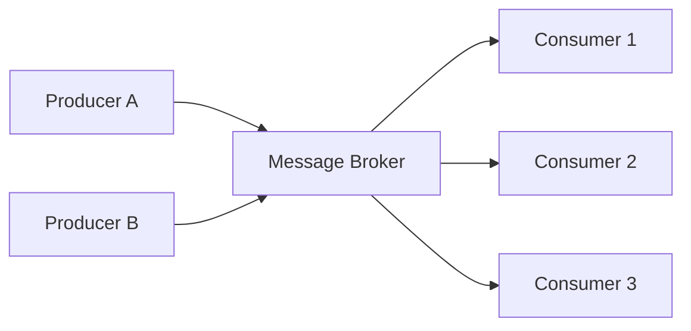
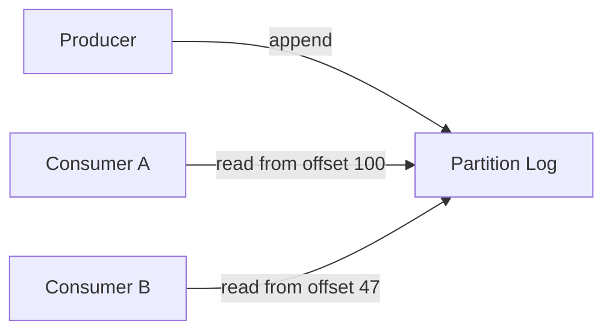

Right now, as you read this, your phone is generating a continuous, unending stream of data — GPS pings, battery sensor updates, app telemetry. For decades, software engineers pretended that data stopped, artificially slicing it into overnight batches. Chapter 12 of DDIA steps out of that comfortable fiction and into the unbounded, never-ending reality of stream processing.

> ##### Source
>
> Notes drawn from Chapter 12 of _Designing Data-Intensive Applications_ (2nd ed.) by Martin Kleppmann & Chris Riccomini.
> {: .block-tip }

> ##### Created With
>
> These notes were structured with the help of [NotebookLM](https://notebooklm.google.com), using podcast-style audio overviews generated from the book chapters.
> {: .block-tip }

---

## 1. The Limits of Batch: Stale Data

Batch processing is safe and predictable. You have a bounded CSV, you run a script at midnight, you get a report. The problem: by 4 PM, that report is 16 hours stale. For fraud detection, stale is catastrophic — you can't wait an hour to block a stolen credit card.

The core issue is **latency introduced by artificial batch boundaries**. If your ETL runs at midnight and your users generate data continuously between midnight and 11:59 PM, the maximum possible latency of your analytics is 24 hours.

Stream processing abandons those fixed slices entirely.

---

## 2. Unbounded Data: Events and Immutability

In a streaming context:

- A single record is called an **event**: a small, self-contained, immutable object (usually JSON or Protobuf) recording something that happened at a specific instant.
- Events are **immutable** — you cannot change history. A user clicked "add to cart" at 14:32:07.003. That fact is permanent.
- A dataset in the real world is **never complete** — unless your company shuts down, your users will produce data indefinitely.

A data stream is therefore **unbounded data**: a sequence of events that has a beginning but no end.

---

## 3. Message Transport: From Polling to Brokers

### Why Databases Fail as Queues

The naive approach: producer writes to a Postgres table; consumer polls with `SELECT * FROM events WHERE processed = false`. At real-time throughput, the consumer runs 1,000 queries per second. 999 of them return empty. You burn CPU, exhaust connection pools, and waste bandwidth just to be told "nothing new."

### Direct Messaging

Higher-level direct messaging (HTTP webhooks, UDP multicast) avoids polling. But if the consumer is offline for 30 seconds during a deploy, the producer gets a 500 error. Does it retry? Drop the event? Either choice is wrong.

### Message Brokers

A **message broker** is specialized infrastructure sitting between producers and consumers:



Producers write to the broker; the broker acknowledges immediately and takes responsibility for delivery. Consumers read at their own pace. Two distribution patterns:

| Pattern            | Behavior                                  | Use Case                                              |
| ------------------ | ----------------------------------------- | ----------------------------------------------------- |
| **Load balancing** | Each message goes to exactly one consumer | Parallel processing of a high-volume queue            |
| **Fan-out**        | Each message goes to every consumer       | Multiple independent services react to the same event |

### Acknowledgments and the Poison Pill Problem

Consumers send an **ACK** after successfully processing a message. If the consumer crashes before ACKing, the broker re-delivers the message to another consumer — preventing data loss.

But what if the message itself is broken? A malformed JSON payload with a missing `user_id` field throws a null pointer exception. The consumer crashes. The broker re-delivers the same bad message. The consumer crashes again. In a loop. The queue backs up. The entire stream is paralyzed by one **poison pill**.

The fix: **Dead Letter Queue (DLQ)**. After N consecutive failed attempts (e.g., 5), the broker automatically routes the offending message to a separate quarantine queue. Healthy messages keep flowing. A human engineer inspects the DLQ, fixes the root cause, and replays the message later.

---

## 4. Log-Based Brokers: Kafka

Traditional message brokers delete messages after a consumer ACKs them. If a new consumer wants to replay last month's events, those events are gone.

Apache Kafka, originally built at LinkedIn, solved this by fusing the durability of a database with the pub-sub model of a broker.

### Architecture

A Kafka **topic** is partitioned into multiple **partitions**, each an append-only log written directly to disk.



- Producers **append** to the end of the log — no random writes.
- Consumers **read sequentially** and maintain an **offset** (an integer bookmark) to record their position.
- **Reading is non-destructive** — the consumer never deletes anything.

### Why Sequential Disk Writes Are Fast

Appending to a file is purely sequential I/O. Spinning disks stream sequential data at 150 MB/s+; SSDs are even faster due to prefetching. The OS buffers sequential writes in the **page cache** in RAM. Consumers reading recent data serve it directly from page cache — **zero disk reads**. This "zero-copy optimization" is why Kafka sustains millions of messages per second on commodity hardware.

### Retention at Scale

A 20 TB disk writing at 250 MB/s takes ~22 hours to fill. At realistic production loads (bursts, not sustained maximum), a Kafka cluster easily retains weeks or months of raw events. This gives consumers a superpower: a new experimental service can rewind to an offset from a week ago and replay actual production data with zero risk to the source.

---

## 5. Change Data Capture: Taming the Dual-Write Problem

A typical architecture has Postgres as the transactional source of truth, plus a Redis cache, an Elasticsearch index, and a Snowflake data warehouse. Keeping them in sync via application-level dual writes is a silent data corruption waiting to happen:

- Client A sets a field to `A`.
- Client B sets the same field to `B`.
- Postgres records `B` as the final value (processes A first, then B).
- Elasticsearch receives the packets in reverse order (network jitter) and records `A` as the final value.
- Both systems returned HTTP 200. No exception was thrown.

**Change Data Capture (CDC)** fixes this by making the primary database the single source of ordered truth. Tools like **Debezium** disguise themselves as a Postgres read replica, consuming the internal **Write-Ahead Log (WAL)**. The WAL is the database's own crash recovery mechanism — an append-only log of every committed change. Debezium reads it and publishes each change as a JSON event to Kafka, including the `before` and `after` state of every row.

All downstream systems — search index, cache, warehouse — become passive consumers of that ordered stream. They cannot receive updates out of order, because the database's WAL defines the canonical sequence.

---

## 6. Log Compaction: Bounded Infinity

If you store every insert/update/delete event forever, the log grows without bound. But a new consumer starting from scratch doesn't care about John's 50 historical username typos — it only needs his current username.

**Log compaction** runs a background process that scans the append-only log, groups events by primary key, and discards all but the most recent event for each key. The log transitions from a full history to a **compact snapshot of current state** — still ordered, still immutable, but garbage-collected of superseded records.

---

## 7. State as the Integral of a Stream

A profound mathematical identity from the chapter:

> **State = ∫ stream dt**
>
> **Stream = d(state)/dt**

Your bank account balance (state) is the sum of every deposit and withdrawal (stream) over time. The ledger of transactions is the stream; the current balance is its integral.

This reframes data modeling. Instead of asking "what is the current state?" you ask "how did we arrive at the current state?" This shift has a practical implication: if your database state is corrupted by a bug, you don't write recovery scripts. You drop the corrupted tables, fix the bug, and replay the immutable event log from offset zero. The correct state rebuilds itself deterministically.

---

## 8. Time: Event Time vs. Processing Time

When a product manager asks for a "5-minute rolling average of checkout revenue," you must decide what "5 minutes" means:

| Time concept        | Definition                                                            | Risk                                                                                                                        |
| ------------------- | --------------------------------------------------------------------- | --------------------------------------------------------------------------------------------------------------------------- |
| **Processing time** | The server's clock when it receives the event                         | A network outage causes 1 hour of events to arrive simultaneously — instant spike in metrics that never happened in reality |
| **Event time**      | The timestamp embedded in the event payload by the originating device | Late arrivals (subway tunnels, poor signal) complicate windowing                                                            |

**Always window by event time.** Processing time produces metrics that are detached from reality whenever the network is unreliable.

The cost: you must decide how long to wait for **straggler events** — data that physically occurred inside a window but arrived late. Stream engines like Apache Flink use **watermarks**: heuristic signals declaring "I am reasonably confident I've received all events older than T." Stragglers arriving after the watermark require a policy choice:

- **Drop**: acceptable for rough trend analysis, catastrophic for billing.
- **Publish corrections**: output a preliminary result when the watermark passes, then emit an updated result (a retraction) when the straggler arrives. Downstream systems must handle retractions.

---

## 9. Window Types

| Window       | Description                                                                               | Use Case                                            |
| ------------ | ----------------------------------------------------------------------------------------- | --------------------------------------------------- |
| **Tumbling** | Fixed length, no overlap. Event belongs to exactly one window.                            | Hourly aggregation buckets                          |
| **Hopping**  | Fixed length, overlapping. A 5-min window hopping every 1 min produces a rolling average. | Smoothed dashboards                                 |
| **Sliding**  | Groups events within a proximity of each other, regardless of absolute time.              | "3 login failures within 5 minutes" fraud detection |
| **Session**  | Groups a single user's activity bursts; window closes after a period of inactivity.       | User engagement and session length                  |

---

## 10. Stream Joins: Three Types

Joining streams is vastly more complex than joining database tables because the data is infinite and arrives at uncontrolled rates.

### Stream-Stream Join

Join a "search query" stream with a "click" stream to calculate click-through rates. The stream processor must hold the search event in RAM for a configurable window (e.g., 10 minutes), waiting for a matching click. High query volumes mean significant memory pressure.

### Stream-Table Join (Enrichment)

Enrich a high-volume event stream with a static reference table (e.g., join `user_id` events with a user profile database to add demographic data). The naive approach — querying Postgres on every event — destroys the database.

The solution: **local hash join**. Using CDC, the stream processor maintains a continuously updated local copy of the reference table inside its own embedded store (e.g., RocksDB). Enrichment lookups become in-process memory accesses — no network round-trips, no database load.

### Table-Table Join (Materialized View)

Maintain a real-time pre-computed join. Example: Twitter's timeline cache — the join of "posts" and "follower graph" — is continuously updated as new posts arrive or follows change. The stream processor continuously recalculates and caches the result.

---

## 11. Fault Tolerance: Checkpointing and Idempotence

If a stream processor crashes mid-window, all its buffered state is lost. Two approaches:

### Micro-batching (Spark Streaming)

Slice the infinite stream into 1-second mini-batches and treat each as a tiny batch job. If a mini-batch fails, discard it and retry from the source log. Simple, but introduces 1-second minimum latency.

### Distributed Snapshots (Flink)

Periodically inject **barrier markers** into the stream. When the processor sees a barrier, it snapshots all in-memory state (windows, local join tables, Kafka offsets) to durable storage (e.g., S3). On crash, reload the last snapshot and replay from the saved offset. No mini-batch latency penalty.

### Idempotence: The Universal Safety Net

Design every output operation to be **idempotent**: applying it N times produces the same result as applying it once.

```sql
-- Not idempotent: each retry increments the counter
UPDATE table SET counter = counter + 1 WHERE id = 5;

-- Idempotent: duplicate writes are harmless
INSERT INTO processed (kafka_offset, result) VALUES (42, 'done')
  ON CONFLICT (kafka_offset) DO NOTHING;
```

Using the Kafka offset as a unique key in the output database turns every insert into an idempotent upsert. A crash-and-replay produces a duplicate write attempt; the primary key constraint silently rejects it. Exactly-once semantics achieved without distributed locking.

---

## 12. GDPR and Crypto-Shredding

Immutable append-only logs and GDPR's "right to be forgotten" seem fundamentally contradictory — you cannot delete from an immutable log without destroying consumer offsets.

The industry's solution: **crypto-shredding**. Instead of storing plaintext sensitive fields in the event, encrypt them with a user-specific key before appending. Store the keys in a separate, mutable key store. When a user exercises the right to erasure, delete their encryption key. The encrypted data remains in the log permanently — but it is now mathematically unreadable gibberish, satisfying the compliance requirement without breaking the log's append-only guarantee.

---

## Summary

| Topic             | Key Insight                                                                                    |
| ----------------- | ---------------------------------------------------------------------------------------------- |
| Unbounded data    | Real-world data streams never end; batch boundaries introduce artificial latency               |
| Message brokers   | Decouple producers from consumers; ACKs + DLQ prevent poison pills                             |
| Log-based brokers | Non-destructive reads; offset bookmarks; consumers can replay history                          |
| CDC               | Database WAL as the canonical ordered event stream; fixes dual-write corruption                |
| Log compaction    | Compact current state from full history; bounding log size without losing truth                |
| Event time        | Always window by event time; watermarks manage straggler events                                |
| Windows           | Tumbling, hopping, sliding, session — each matches a different analytical pattern              |
| Stream joins      | Stream-stream (RAM-intensive); stream-table (local hash join); table-table (materialized view) |
| Fault tolerance   | Micro-batching or Flink snapshots; idempotent output operations                                |
| Crypto-shredding  | GDPR compliance on immutable logs via key deletion                                             |
