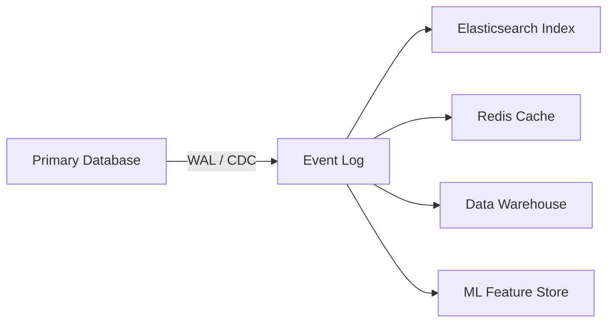
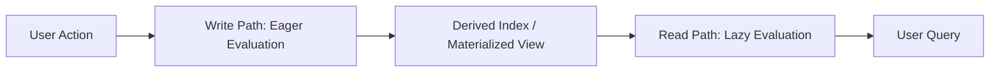

A global bank handles billions of dollars flawlessly, even though it is mathematically impossible to know anyone's true account balance at any given millisecond — because the underlying databases are scattered across continents and thousands of transactions fly through the system every second. Chapter 13 of DDIA takes all the isolated concepts of the previous chapters and weaves them into a unified theory of how to actually build modern, reliable software at scale.

> ##### Source
>
> Notes drawn from Chapter 13 of _Designing Data-Intensive Applications_ (2nd ed.) by Martin Kleppmann & Chris Riccomini.
> {: .block-tip }

> ##### Created With
>
> These notes were structured with the help of [NotebookLM](https://notebooklm.google.com), using podcast-style audio overviews generated from the book chapters.
> {: .block-tip }

---

## 1. The Integration Dilemma

Every application that grows beyond a hobby project encounters the same crisis: no single database technology can serve all its access patterns.

- **OLTP database** (Postgres): brilliant for concurrent row-level updates — user signups, shopping cart changes. Terrible for fuzzy full-text search (B-trees are the wrong index structure).
- **Search cluster** (Elasticsearch): optimized for inverted-index lookups. Useless for transactional integrity.
- **Analytics warehouse** (Snowflake): columnar storage, fast for aggregating billions of rows. Catastrophically slow for individual row updates.

So teams cobble together these specialized tools. The next problem: keeping them in sync. Application-level dual writes are a silent data corruption factory. Two clients write the same field concurrently — Postgres applies them in order A → B, Elasticsearch receives them as B → A (network jitter). Both systems return HTTP 200. The inconsistency is invisible until a user complains.

**Change Data Capture** solves this by making the primary database the single canonical timeline. The database's WAL defines the definitive order; all other systems become passive followers of that ordered stream.

---

## 2. The Limits of Total Ordering

CDC enforces a single ordered log — but only within one database instance. Once a system must scale globally, total ordering breaks down:

- **Sharding** splits data across multiple machines, each with its own write log.
- **Multiple data centers** make synchronous cross-site coordination impossible at the speed of light.
- **Microservices** give each service its own database — the payments service and the user service have no shared log.

When events originate from separate sources, there is no universally defined order. Deciding a global order requires distributed consensus protocols — multiple network round-trips — which destroys the performance gains of sharding.

### The Causality Problem

Kleppmann's illustrative example: User A unfriends User B, then immediately sends a rude message to friends. User A's causal intent is clear: the unfriend _precedes_ the rude message. But if friendship status and messages live in separate microservices with separate logs, a notification service might consume the message event before the unfriend event due to network lag — and push the rude message directly to User B.

The causal dependency was never captured or enforced. Solving this without a single bottleneck log requires vector clocks or causal-ordering protocols — notoriously difficult to implement correctly.

---

## 3. Bounded vs. Unbounded: The Processor Spectrum

At their core, batch processors and stream processors share the same algebra: filter, map, group, join, aggregate. The architectural difference is the nature of the input:

|                   | Batch Processor                        | Stream Processor                                 |
| ----------------- | -------------------------------------- | ------------------------------------------------ |
| Dataset           | Bounded (static file with a known end) | Unbounded (infinite sequence of events)          |
| Execution         | Job finishes and stops                 | Runs continuously, indefinitely                  |
| Historical replay | Trivial (re-read the file)             | Requires log-based broker with durable retention |

The boundary between these paradigms has been dissolving for years. Reprocessing historical data is not just for analytics — it is a core tool for **application evolution**.

---

## 4. Schema Migrations: The Railway Gauge Analogy

In 1840s England, rival railway companies built tracks with incompatible gauges. A train built for the Great Western Railway could not run on tracks built by the London and North Western Railway. The government mandated a standard gauge in 1846, but converting thousands of kilometers of track without shutting down the national economy required an ingenious solution: **a third rail added alongside the existing two** (dual gauge), allowing both types of trains to operate simultaneously during the transition. Once all rolling stock was converted, the obsolete rail was removed.

This is exactly how stream-based architectures handle schema migrations. If your application must restructure a critical database table:

1. Write a new stream processing job that replays the full historical event log from offset zero.
2. The job transforms old-schema events into the new schema and writes them to a new, separate database.
3. The old and new databases run simultaneously — powered by the same immutable event log.
4. Gradually shift 1% → 10% → 100% of traffic to the new system.
5. Once the new system is stable, delete the old database.

If anything breaks, the immutable log guarantees you can rebuild the new database from scratch again with no risk to the source. The old system runs unaffected throughout.

---

## 5. Lambda vs. Kappa Architecture

### Lambda Architecture

Historically, teams maintained **two separate codebases**:

- A **batch layer** (Hadoop) crunching complete historical data for accuracy.
- A **speed layer** (Storm) processing live events for recency.
- A **serving layer** merging the two outputs at query time.

The problem: two codebases computing the same business logic. Bugs crept in when they diverged. Maintaining both was a significant operational burden.

### Kappa Architecture

The modern response: **throw away the batch processor entirely**. Use the same stream processing code for everything:

- To process historical data: rewind the Kafka offset to zero and replay.
- When the stream processor catches up to the present: it seamlessly transitions to processing live events, never stopping.

One codebase. One execution model. The stream processor connects to the storage layer, reads historical data as fast as the disks can spin, and when it reaches "now," simply keeps running.

---

## 6. Exactly-Once Semantics

The Kappa architecture requires a difficult guarantee: if the stream processor crashes halfway through three years of historical data and reboots, it cannot produce duplicate outputs or lose records.

The mechanism:

1. The processor tracks position via a Kafka **offset** (an integer).
2. When ready to commit a batch of output, it **wraps the output and the new offset in a single atomic transaction**: either both succeed or neither does.
3. On crash, the processor restarts from the last successfully committed offset.
4. Any partial writes from the failed attempt are invisible to downstream consumers (they check committed state only).

The developer sees exactly-once semantics. Physically, the machine may retry computations many times. The transactional commit marker hides that complexity.

---

## 7. Unbundling the Database: The Unix Philosophy at Scale

Unix builds complex pipelines from small, single-purpose tools connected by pipes. Relational databases do the opposite: a monolithic system that hides all complexity behind SQL.

What does it mean to apply the Unix philosophy at the data center level?

A traditional database's `CREATE INDEX` command scans the table, builds a B-tree structure, and continuously watches the WAL to keep the index updated. **Unbundling** extracts this mechanism into a system-wide architecture:

- The primary database appends writes to a distributed event log (the Unix pipe).
- A separate stream processing job acts as the index builder: it consumes the log and writes the structured index into a specialized Elasticsearch cluster.
- The search cluster is not a standalone product — it is a **continuously updated secondary index** of the primary log, updated asynchronously.

Extend this to every derived system:

The entire organization's data flow becomes one giant distributed database. The log is the central commit log. Indexes, caches, and analytics stores are specialized secondary views of that log.

### Loose Coupling as a Fault Isolation Tool

In a tightly coupled architecture, if the search cluster goes offline for maintenance, every user profile update fails (the synchronous write to Elasticsearch times out). In the unbundled, event-driven architecture:

- The application writes to the primary database only.
- The log buffers events on disk during the outage.
- When the search cluster recovers, it reads the backlog and catches up at high speed.

The application was never disrupted. Components fail independently without cascading.

---

## 8. Federated vs. Unbundled Databases

| Approach                     | What it solves                                                             | What it doesn't                                              |
| ---------------------------- | -------------------------------------------------------------------------- | ------------------------------------------------------------ |
| **Federated** (Presto/Trino) | Unifies the **read path** — one SQL interface over Postgres, S3, Neo4j     | Doesn't synchronize writes; downstream systems still diverge |
| **Unbundled** (Kafka + CDC)  | Unifies the **write path** — single ordered log drives all derived systems | Reads still hit specialized engines directly                 |

Modern architectures typically use both: CDC keeps all systems in sync (unbundled write path), and a federated query engine joins across those systems for analytics (unified read path).

---

## 9. Dataflow Programming: From VisiCalc to the Data Center

**VisiCalc (1979)** was the first electronic spreadsheet — and a pure dataflow programming environment. When you change cell A1, the spreadsheet detects B1's dependency on A1 and automatically recalculates B1. No polling. No scripts. The system understands the dependency graph and propagates state changes through it reactively.

Modern application architectures are trying to achieve exactly this, at the scale of a global data center: when a user updates their profile, that state change should automatically flow through the dependency graph — recalculating the search index, invalidating the cache, updating the recommendation model — just as a spreadsheet cell updates.

Executing that dependency graph across thousands of servers requires stream processing engines. The underlying philosophy is identical to VisiCalc.

---

## 10. The Write Path vs. The Read Path

Every data system has a boundary between two types of computation:

- **Write path (eager)**: computation happens when data arrives, regardless of whether anyone has asked for it yet. Cost: CPU spent even on data nobody ever queries.
- **Read path (lazy)**: computation happens when a user makes a request. Cost: latency on every query; may require scanning millions of rows.

The **materialized view** is the architectural tool for shifting work from the read path to the write path. Instead of scanning a billion rows to count available software engineering books on every query, maintain a counter that increments on checkout and decrements on return. The read becomes a constant-time lookup.

The art of systems architecture is deciding where to draw the boundary. Shift too much to the write path: expensive pre-computation for queries that rarely happen. Shift too little: read queries become unbearably slow.

---

## 11. Extending Dataflow to Clients

If the write path already pushes state changes through the entire data center — from primary database to Kafka to search index — why stop at the data center's edge router?

Modern protocols (WebSockets, Server-Sent Events) maintain persistent connections between server and client. A user's smartphone is not a static HTML snapshot — it is a **local cache of the remote data center's state**.

When a teammate updates a collaborative document on their phone in Tokyo:

1. The event flows to the server and into the distributed log.
2. The stream engine processes it.
3. The result is pushed down the open WebSocket to your browser in London.
4. The browser's reactive UI framework (React's virtual DOM, Elm's architecture) recalculates and re-renders — automatically, because it was already built on reactive dataflow principles.

This architecture also enables **offline-first applications**: when the Tokyo user loses signal in a subway tunnel, the app continues appending local edits to an on-device log (IndexedDB). On reconnection, the local log synchronizes with the server log, resolving conflicts via the stream processor.

---

## 12. Timeliness vs. Integrity

Software engineers arguing about "consistency" often talk past each other because they conflate two distinct properties:

| Property       | Definition                                                                | Failure mode                          |
| -------------- | ------------------------------------------------------------------------- | ------------------------------------- |
| **Timeliness** | Seeing up-to-date data promptly                                           | Stale reads (temporary, self-healing) |
| **Integrity**  | Absence of corruption; no data silently dropped or calculated incorrectly | Permanent data corruption             |

The key rule of scalable systems:

> **Violations of timeliness are acceptable. Violations of integrity are not.**

A bank transfer that takes 60 seconds to appear in your balance is a timeliness violation — annoying, but it resolves itself. A bank transfer that charges you twice is an integrity violation — permanent, requiring manual intervention.

Eventual consistency sacrifices timeliness in exchange for availability and scalability. It is not the same as sacrificing integrity.

---

## 13. The Art of the Apology: Compensating Transactions

Enforcing hard constraints synchronously in a distributed system requires distributed locking (2PC), which has brutal throughput implications. The alternative: **accept eventual inconsistency, detect conflicts asynchronously, and compensate**.

**Airlines deliberately overbook flights.** Enforcing a strict "max 150 seats" constraint with a distributed lock would prevent selling ticket 151 until 150 other transactions complete — unnecessary overhead on every ticket purchase. Instead, airlines allow overselling, detect it at gate time, and compensate with vouchers and rebooking.

The **compensating transaction** is not a failure mode — it is a deliberate architectural choice. The system maintains high write throughput (no locks), accepts that inconsistencies will occasionally materialize in the physical world, and handles them with automated business processes.

> If the cost of the apology (refund, discount code, email) is low relative to the cost of enforcing the constraint (distributed locks, latency, complexity), accept eventual consistency and build the apology process.

---

## 14. Trust but Verify: Checksums and Merkle Trees

Even with immutable event logs and deterministic stream processors, physical hardware is imperfect:

- A high-energy cosmic ray flips a RAM bit from 0 to 1.
- A degraded disk controller silently writes garbage bytes.
- A logic bug corrupts thousands of rows before anyone notices.

Mature distributed storage systems (HDFS, S3) don't blindly trust hardware. When writing a file, they compute a **cryptographic checksum** and store it alongside the data. Background daemons continuously crawl the disks, recompute checksums, and compare them against originals and replicas. Detected corruption triggers automatic healing from a healthy replica.

The event sourcing architecture amplifies this. If you suspect your production database state has been corrupted by yesterday's bug:

1. Take the original immutable event log.
2. Replay it through a fixed, bug-free version of the stream processor in a staging environment.
3. Mathematically compare the freshly generated output to the corrupted production database.

The immutable log is a time machine for auditing.

**Merkle trees** take this further for adversarial environments (public blockchains). Every transaction is hashed; pairs of hashes are concatenated and hashed again; the process repeats up a tree until a single **root hash** represents the entire dataset. Altering any single transaction cascades through the tree, changing the root hash — making tampering mathematically detectable even when half the nodes are actively lying. Each block embeds the previous block's root hash, creating an unforgeable chain of custody.

---

## Summary

| Concept                   | Core Insight                                                                         |
| ------------------------- | ------------------------------------------------------------------------------------ |
| Integration dilemma       | No single DB fits all access patterns; CDC + event log keeps derived systems in sync |
| Causality                 | Losing total order at scale creates causal violations that require vector clocks     |
| Kappa architecture        | One stream processor for both historical replay and live processing                  |
| Exactly-once              | Atomic commit of output + offset; physical retries hidden from downstream            |
| Unbundled database        | Log as Unix pipe; search indexes and caches as specialized secondary indexes         |
| Write path vs. read path  | Materialized views shift computation from queries to ingestion                       |
| Timeliness vs. integrity  | Eventual consistency sacrifices timeliness, never integrity                          |
| Compensating transactions | Accept inconsistency; automate the apology                                           |
| Merkle trees              | Cryptographic tamper-evidence for adversarial distributed environments               |
